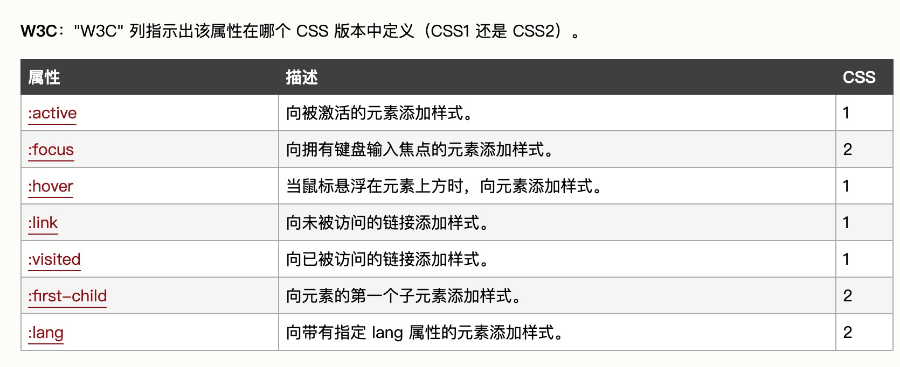

# 经常遇到的css问题
## 超过宽度，显示...
* 超出一行，显示..., 需指定宽度
  ```css
  overflow {
    overflow: hidden;
    text-overflow: ellipsis;
    white-space: nowrap;
    display: block;
    width: 100%;
  }
  ```
* 超出两行，显示...，需指定宽度（兼容性不好，详情查看[css兼容性](./css_compatibility.md)）
```css
overflow2 {
  overflow: hidden;
  text-overflow: ellipsis;
  display: -webkit-box;
  -webkit-line-clamp: 2;
  -webkit-box-orient: vertical;
}
```
所遇问题
> -webkit-box-orient: vertical 在使用 webpack 打包的时候这段代码会被删除掉，原因是 optimize-css-assets-webpack-plugin 这个插件的问题。

```css
    /*! autoprefixer: off */
    -webkit-box-orient: vertical;
    /* autoprefixer: on */
```

## 两端对齐

```
div {
    margin: 10px 0;
    width: 100px;
    border: 1px solid red;
    text-align: justify;
    text-align-last:justify;
    -moz-text-align-last: right; /* 针对 Firefox 的代码 */
}
div:after{
    content: '';
    display: inline-block;
    width: 100%;
}


```
## table的td里换行问题
* 描述： table的td里如果是比较长的数字，会影响样式，不会换行，所以需要加强制换行，兼容浏览器换行
```css
td {
  -ms-word-break: break-all;    // ie
  word-break:break-all;         // ff
  word-break: break-word;       // chrome
}
```

## 伪类和伪元素




## 充分利用 + 选择器
* 第二个、第三个li加粗 当除了第一个，其他子元素都有共同的样式时

```html
<ul>
    <li>List item 1</li>
    <li>List item 2</li>
    <li>List item 3</li>
  </ul>
```
```css
li + li {font-weight:bold;}
```

## 利用伪类实现三角形

```css
.sanjiao {
      position: relative;
      background-color: #666;
    }
    .sanjiao::after {
      position: absolute;
      content: '';
      width: 0;
      height: 0;
      border: 10px solid transparent;
      border-left: 10px solid red;
    }
```

## 清除浮动元素的方法

1. 外墙元素隔离法，新增clear标签  `.clear{ clear:both} `，在浮动元素的父元素外 ;
2. 内墙元素隔离法，在浮动元素父元素内
3. 利用伪类
```css
.clearfix:before, .clearfix:after {
  display: table;
  content: '';
  clear: both;
}
```
4. 父元素设置高度
5. 父元素定义 *overflow: hidden* 该属性相当于是让父级紧贴内容，这样即可紧贴其对象内内容（包括使用float的div盒子），从而实现了清除浮动。

6. 利用清除属性clear 浮动元素的父辈仍然没有高度,此时清除元素的margin-top失效

## transform translate、transition

* transition
将鼠标悬停在一个 div 元素上，逐步改变表格的宽度从 100px 到 300px：:
```css
div
{
    width:100px;
    transition: width 2s;
    -webkit-transition: width 2s; /* Safari */
}
div:hover {width:300px;}
```

|值|描述|
|:----|:----|
|transition-property|	指定CSS属性的name，transition效果|
|transition-duration	|transition效果需要指定多少秒或毫秒才能完成|
|transition-timing-function	|指定transition效果的转速曲线|
|transition-delay	|定义transition效果开始的时候|

* transform 语法
```css
transform: none|transform-functions;
```
|值	|描述|
|:---|:---|
|none	|定义不进行转换。
|matrix(n,n,n,n,n,n)	|定义 2D 转换，使用六个值的矩阵。
|matrix3d(n,n,n,n,n,n,n,n,n,n,n,n,n,n,n,n)|	定义 3D 转换，使用 16 个值的 4x4 矩阵。
|translate(x,y)	|定义 2D 转换。
|translate3d(x,y,z)	|定义 3D 转换。
|translateX(x)	|定义转换，只是用 X 轴的值。
|translateY(y)	|定义转换，只是用 Y 轴的值。
|translateZ(z)	|定义 3D 转换，只是用 Z 轴的值。
|scale(x[,y]?)	|定义 2D 缩放转换。
|scale3d(x,y,z)|	定义 3D 缩放转换。
|scaleX(x)	|通过设置 X 轴的值来定义缩放转换。
|scaleY(y)	|通过设置 Y 轴的值来定义缩放转换。
|scaleZ(z)	|通过设置 Z 轴的值来定义 3D 缩放转换。
|rotate(angle)	|定义 2D 旋转，在参数中规定角度。
|rotate3d(x,y,z,angle)|	定义 3D 旋转。
|rotateX(angle)	|定义沿着 X 轴的 3D 旋转。
|rotateY(angle)	|定义沿着 Y 轴的 3D 旋转。
|rotateZ(angle)	|定义沿着 Z 轴的 3D 旋转。
|skew(x-angle,y-angle)|	定义沿着 X 和 Y 轴的 2D 倾斜转换。
|skewX(angle)	|定义沿着 X 轴的 2D 倾斜转换。
|skewY(angle)	|定义沿着 Y 轴的 2D 倾斜转换。
|perspective(n)	|为 3D 转换元素定义透视视图。
[具体请看](./transform.html)
[transform](https://c.runoob.com/codedemo/3391)