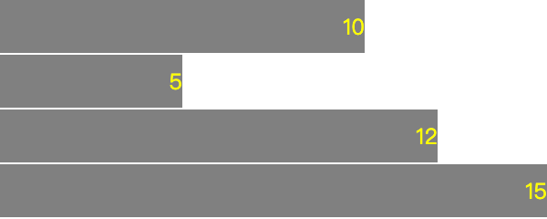

# d3 选择器

## 获取html 的元素Method

### select 选择器 selectAll 选择器
```js
d3.select('div');
d3.select('.div');
d3.select('#div');
d3.selectAll('div');
d3.selectAll('.div');
d3.selectAll('#div');
```

### append() method
```js
var body = d3.select('div')
var span = body.append('span') // <div><span>d3.js<span><div>
span.text('from d3.js')
```

### html() method

```js
 d3.select(".myclass").html("Hello World! <span>from D3.js</span>"); // 替换myclass中的内容，span标签会解析
```

## attr() method
```js
d3.select(".myclass").attr("style", "color: red");
```
## style() method
```js
d3.select(".myclass").style("color", "red");
```

### The classed() Method
classed（）方法专门用于设置HTML元素的"class"属性。此方法知道如何处理元素上的一个或多个类，并且它将具有高性能。

* 添加类:要添加类，必须将分类方法的第二个参数设置为true。 它定义如下:
```js
d3.select(".myclass").classed("addclass", true);
```
* 删除类:要删除类，必须将分类方法的第二个参数设置为false。 它定义如下:
```js
d3.select(".myclass").classed("removeclass", false);
```
* 检查类:要检查是否存在类，只需省略第二个参数并传递要查询的类名。 如果存在则返回true，如果不存在，则返回false。
```js
d3.select(".myclass").classed("hasclass");
```
如果选择中的任何元素具有类，则返回true。 使用d3.select进行单个元素选择。

* 切换类:将类翻转到相反的状态 - 如果它已经存在则将其删除，如果它尚不存在则添加它 - 您可以执行以下操作之一。

对于单个元素，代码可能如下所示:
```js
var element = d3.select(".myclass")
element.classed("myanotherclass", !oneBar.classed("myanotherclass"));
```
### The selectAll() Method
selectAll（）方法用于选择HTML文档中的多个元素。 select方法选择第一个元素，但selectAll方法选择与特定选择器字符串匹配的所有元素。 如果选择匹配none，则返回空选择。 我们也可以在selectAll（）方法中链接所有附加的修改方法，append（），html（），text（），attr（），style（），classed（）等。 在这种情况下，方法将影响所有匹配元素。 

```js
 d3.selectAll(".myclass").attr("style", "color: red");
```

## d3.js 数据加入

默认情况下，D3.js在其方法中为数据集提供最高优先级，并且数据集中的每个项对应于HTML元素.本章详细介绍了数据连接.

### 什么是数据连接？
数据连接使我们能够注入，修改和删除元素(HTML元素)以及基于现有HTML文档中的数据集的嵌入式SVG元素.默认情况下，数据集中的每个数据项对应于文档中的元素(图形).

随着数据集的变化，也可以轻松操作相应的元素.数据连接在我们的数据和文档的图形元素之间创建了一种紧密的关系.数据连接使得基于数据集的元素操作变得非常简单和容易.

* 数据连接如何工作？

主要目的是数据连接是使用给定的数据集映射现有文档的元素.它根据给定的数据集创建文档的虚拟表示，并提供使用虚拟表示的方法.让我们考虑一个简单的数据集，如下所示.

数据集有五个项目，因此，它可以映射到文档的五个元素.让我们使用选择器的selectAll()方法和数据连接的data()方法将它映射到以下文档的 li 元素.
```html
<ul id = "list">
   <li><li>
   <li></li>
</ul>
<input type = "button" name = "remove" value = "Remove fourth value" 
         onclick = "remove()" />
<script>
/* D3.js代码
d3.select("＃list ").selectAll("li").data([10,20,30,25,15]);
前两个虚拟元素对应文档中定义的两个 li 元素
1. li - 10
2. li - 20
// 我们可以使用所有选择器的元素修改方法，如 attr()，style()，text ()等，对于前两个 li 

d3.select("#list").selectAll("li")
   .data([10, 20, 30, 25, 15])
   .text(function(d) { return d; }); // 填充前两个li

下一个三个元素可以映射到任何元素，可以使用数据连接的enter()和selector的append()方法完成. enter()方法提供对剩余数据的访问(未映射到现有元素)，append()方法用于从相应数据创建新元素.我们也为剩余的数据项创建 li .数据地图如下 :

3. li - 30
4. li - 25
5. li - 15
*/
// 创建新的li元素的代码如下 :
d3.select("#list").selectAll("li")
   .data([10, 20, 30, 25, 15])
   .text(function(d) { return "This is pre-existing element and the value is " + d; })
   .enter()
   .append("li")
   .text(function(d) 
      { return "This is dynamically created element and the value is " + d; });

      // 数据连接提供另一种方法，称为 exit()方法，用于处理从数据集中动态删除的数据项，我们已经从数据集及其相应的li中删除了第四项exit()和remove()方法.
      function remove() {
        d3.selectAll("li").data([10, 20, 30, 15]).exit().remove()
      }
</script>

```

### Data Join Methods
数据连接提供以下四种方法来处理数据集:
* datum()
* data()
* enter()
* exit()

#### The datum() Method
datum（）方法用于为HTML文档中的单个元素设置值。 一旦使用选择器选择元素，就会使用它。 例如，我们可以使用select（）方法选择现有元素（p标签），然后使用datum（）方法设置数据。 设置数据后，我们可以更改所选元素的文本或添加新元素，并使用datum（）方法设置的数据分配文本。
```js
d3.select("p")
         .datum(50)
         .text(function(d) { 
            return "Used existing paragraph element and the data " + d + " is assigned."; // p元素里的文本
         });
         
         d3.select("div")
         .datum(100)
         .append("p")
         .text(function(d) { 
            return "Created new paragraph element and the data " + d + " is assigned."; // div里插入p，设置p的文本为datum里的data
         });
```

#### The data() method
data（）方法用于将数据集分配给HTML文档中的元素集合。 使用选择器选择HTML元素后使用它。 在我们的列表示例中，我们使用它来设置li选择器的数据集。
```js
d3.select("#list").selectAll("li")
   .data([10, 20, 30, 25, 15]);
```
### The enter() method
enter（）方法输出之前没有图形元素的数据项集。 在我们的列表示例中，我们使用它来创建新的li元素。
```js
d3.select("#list").selectAll("li")
   .data([10, 20, 30, 25, 15])
   .text(function(d) { return "This is pre-existing element and the value is " + d; })
   .enter()
   .append("li")
   .text(function(d) { return "This is dynamically created element and the value is " + d; });
```
#### The exit() method
exit（）方法输出不再存在数据的图形元素集。 在我们的列表示例中，我们使用它通过删除数据集中的数据项来动态删除其中一个li元素。
```js
function remove() {
   d3.selectAll("li")
      .data([10, 20, 30, 15])
      .exit()
      .remove()
}
```
#### Data Function
在DOM操作章节中，我们了解了D3.js中的不同DOM操作方法，例如style（），text（）等。这些函数中的每一个通常都以常量值作为参数。 然而，在Data join的上下文中，它将匿名函数作为参数。 此匿名函数获取相应的数据和使用data（）方法分配的数据集的索引。 因此，将为绑定到DOM的每个数据值调用此匿名函数。 考虑以下text（）函数。
```js
.text(function(d, i) {
   return d;
});
```
在此函数中，我们可以应用任何逻辑来操纵数据。 这些是匿名函数，意味着没有与函数关联的名称。 除了data（d）和index（i）参数之外，我们可以使用此关键字访问当前对象，如下所示:
```js
var data = [1, 2, 3];
var paragraph = d3.select("body")
.selectAll("p")
.data(data)
.text(function (d, i) {
   console.log(d); // the data element
   console.log(i); // the index element
   console.log(this); // the current DOM object
  // 参数"d"为您提供数据元素，"i"为您提供数组中的数据索引，"this"是当前DOM元素的引用
  return "The index is " + i + " and the data is " + d;
});
```
## svg 简介

SVG代表可缩放矢量图形. SVG是一种基于XML的矢量图形格式.它提供了绘制不同形状的选项，如直线，矩形，圆形，椭圆等.因此，使用SVG设计可视化为您提供更多的功能和灵活性.

### SVG的功能
SVG的一些显着特征如下:
* SVG是一种基于矢量的图像格式，它是基于文本的.

* SVG在结构上与HTML类似.

* SVG可以表示为文档对象模型.

* 可以将SVG属性指定为属性.

* SVG应该具有相对于原点(0,0)的绝对位置.

* SVG可以包含在HTML文档中.

让我们创建一个最小的SVG图像并将其包含在HTML文档中.


```html
<!-- 创建一个SVG图像并将宽度设置为300像素，高度设置为300像素
svg 标签启动SVG图像，它具有宽度和高度作为属性. SVG格式的默认单位是像素. -->

<svg width = "300" height = "300">
<!-- 创建一条从(100,100)开始到(200,100)结束的行，并为该行设置红色. -->
<line x1 = "100" y1 = "100" x2 = "200" y2 = "200" 
   style = "stroke:rgb(255,0,0);stroke-width:2"/>
<!-- 行标记绘制一条线，其属性 x1，y1 指的是起始线点和 x2，y2 指的是结束点. style属性使用笔划和笔划宽度样式设置线条的颜色和粗细. -->
</svg>
```


### SVG Using D3.js
要使用D3.js创建SVG，请按照下面给出的步骤操作。

```js
// 创建一个容器来保存SVG图像
// 使用select（）方法选择SVG容器，并使用append（）方法注入SVG元素。 使用attr（）和style（）方法添加属性和样式。
var width = 300;
var height = 300;
var svg = d3.select("#svgcontainer")
   .append("svg").attr("width", width).attr("height", height);
// 在svg元素中添加line元素，如下所示。
svg.append("line")
   .attr("x1", 100)
   .attr("y1", 100)
   .attr("x2", 200) 
   .attr("y2", 200)
   .style("stroke", "rgb(255,0,0)")
   .style("stroke-width", 2);
```

### Rectangle Element
* 矩形由`<rect>`标记表示，如下所示。
```html
<svg width = "300" height = "300">
  <rect x = "20" y = "20" width = "300" height = "300" fill = "green">
  </rect>
</svg>
<!-- 矩形的属性如下:

x :这是矩形左上角的x坐标。

y: 这是矩形左上角的y坐标。

width: 这表示矩形的宽度。

height :这表示矩形的高度。 -->

```

* 可以如下所述动态创建相同的矩形.

```js
var width = 300;
         var height = 300;
         //Create SVG element
         var svg = d3.select("#svgcontainer")
            .append("svg")
            .attr("width", width)
            .attr("height", height);
         //Create and append rectangle element
         svg.append("rect")
            .attr("x", 20)
            .attr("y", 20)
            .attr("width", 200)
            .attr("height", 100)
            .attr("fill", "green");
```
### Circle Element
圆圈由<circle>标签表示，如下所述.
```html
<svg width = "300" height = "300">
   <circle cx = "200" cy = "50" r = "20" fill = "green"/>
<!-- cx :这是圆心的x坐标。
cy : 这是圆心的y坐标。
r :这表示圆的半径。 -->
</svg>
```
* 使用SVG动态创建相同的圆圈.
```js
var width = 300;
         var height = 300;
         //Create SVG element
         var svg = d3.select("#svgcontainer")
            .append("svg")
            .attr("width", width)
            .attr("height", height);
         //Append circle 
         svg.append("circle")
            .attr("cx", 200)
            .attr("cy", 50)
            .attr("r", 20)
            .attr("fill", "green");
```
### Ellipse Element
SVG Ellipse元素由`<ellipse>`标记表示，如下所述.
```html
<svg width = "300" height = "300">
   <ellipse cx = "200" cy = "50" rx = "100" ry = "50" fill = "green" />
</svg>
<!-- // 椭圆的属性如下:

// cx:这是椭圆中心的x坐标.

// cy:这是椭圆中心的y坐标.

// rx: 这是圆的x半径.

// ry:这是圆的y半径. -->
```
* 使用d3进行svg绘制
```js
var width = 300;
         var height = 300;
         var svg = d3.select("#svgcontainer")
            .append("svg")
            .attr("width", width)
            .attr("height", height);
         svg.append("ellipse")
            .attr("cx", 200)
            .attr("cy", 50)
            .attr("rx", 100)
            .attr("ry", 50)
            .attr("fill", "green")
```

## SVG 转换

SVG提供了转换单个SVG形状元素或SVG元素组的选项. SVG转换支持翻译，缩放，旋转和倾斜.让我们在本章中学习转换.

### SVG转换简介
SVG引入了一个新属性转换来支持转型.可能的值是以下一项或多项:

翻译 : 它需要两个选项， tx 指的是沿x轴的平移， ty 指的是沿y轴的平移.对于示例 : 翻译(30 30).

旋转 : 它需要三个选项，角度指旋转角度， cx 和 cy 指的是x和y轴旋转的中心.如果未指定 cx 和 cy ，则默认为坐标系的当前原点.对于示例 : 旋转(60).

比例 : 它有两个选项， sx 是指沿x轴的缩放因子， sy 是指沿y轴的缩放因子.这里， sy 是可选的，如果未指定，则它取 sx 的值.对于示例 :  scale(10).

歪斜(SkewX和SkewY) : 它只需一个选项; 倾斜角是指SkewX沿x轴的角度和SkewY沿y轴的角度.对于示例 :  skewx(20).
```html
<!-- 
  带有translate的SVG矩形
可以使用空格作为分隔为单个SVG元素指定多个转换。 如果指定了多个值，则将按指定的顺序逐个应用转换。
转换也可以应用于SVG组元素。 这使得能够转换SVG中定义的复杂图形，如下所述。

要创建SVG图像，请尝试缩放，并使用变换旋转它
Step 1 : 创建SVG图像并将宽度设置为300像素，将高度设置为300像素。
Step 2: 创建一个SVG组。
Step 3:创建一个长度为60且高度为30的矩形，并用绿色填充它。
Step 4 :创建一个半径为30的圆，并用红色填充它。
Step 5 : 添加转换属性并添加平移和旋转，如下所示。 
-->
 <div id = "svgcontainer">
         <svg width = "300" height = "300">
            <g transform = "translate(60,60) rotate(30)">
               <rect x = "20" 
                  y = "20" 
                  width = "60" 
                  height = "60" 
                  fill = "green">
               </rect>
               <circle cx = "0" 
                  cy = "0" 
                  r = "30" 
                  fill = "red"/>
            </g>
         </svg>
      </div>
```

### Transformation Using D3.js
要使用D3.js创建SVG，请按照下面给出的步骤操作。

```js
 var width = 300;
            var height = 300;
            var svg = d3.select("#svgcontainer")
               .append("svg")
               .attr("width", width)
               .attr("height", height);

            var group = svg.append("g")
               .attr("transform", "translate(60, 60) rotate(30)");
            
            var rect = group.append("rect")
               .attr("x", 20)
               .attr("y", 20)
               .attr("width", 60)
               .attr("height", 30)
               .attr("fill", "green")
            
            var circle = group
               .append("circle")
               .attr("cx", 0)
               .attr("cy", 0)
               .attr("r", 30)
               .attr("fill", "red")
```
### 转换库
D3.js提供了一个单独的库来管理转换，而无需手动创建转换属性.它提供了处理所有类型转换的方法.一些方法是 transform()，translate()，scale()，rotate()等.您可以使用以下脚本在网页中包含 d3-transform .
```html
< script src ="http://d3js.org/d3.v4.min.js"></script&gt ; 
< script src ="d3-transform.js"></script>
```
在上面的例子中，转换代码可以写成如下所示 :
```js
var my_transform = d3Transform()
   .translate([60, 60])
   .rotate(30);

var group = svg
   .append("g")
   .attr("transform", my_transform);
```

## D3.js - Transition

过渡是一个项目从一个状态转换到另一个状态的过程. D3.js提供了一个 transition()方法来在HTML页面中执行转换.让我们在本章中了解转换.

### transition()方法
transition()方法适用于所有选择器，它启动过渡进程.此方法支持大多数选择方法，如-attr()，style()等.但是，它不支持append()和data()方法，这些方法需要在transition()方法之前调用.此外，它提供了特定于转换的方法，如duration()，ease()等.一个简单的转换可以定义如下 :
```js
d3.select("body")
   .transition()
   .style("background-color", "lightblue");
```

可以使用d3.transition()方法直接创建转换，然后与选择器一起使用，如下所示.

```js
 
var t = d3.transition()
   .duration(2000);
d3.select("body")
   .transition(t)
   .style("background-color", "lightblue");
```
## D3.js - 动画

D3.js通过过渡支持动画.我们可以通过正确使用过渡来做动画.转换是关键帧动画的有限形式，只有两个关键帧 - 开始和结束.起始关键帧通常是DOM的当前状态，而结束关键帧是您指定的一组属性，样式和其他属性.转换非常适合转换到新视图，而不需要依赖于起始视图的复杂代码.

### 持续时间()方法
duration()方法允许属性更改在指定的持续时间内平滑发生，而不是瞬间发生.让我们使用以下代码进行5秒的转换.
```js
 d3.selectAll("h3").transition().style("color","green").duration(5000);

// 此处，转换平稳且均匀.我们还可以使用以下方法直接指定RGB颜色代码值.
 d3.selectAll("h3").transition().style("color","rgb(0,150,120)").duration(5000);
```

现在，每个颜色编号从0到150缓慢，平滑且均匀地进行.要获得从起始帧值到中间帧的准确混合结束帧值，D3.js使用内部插值方法.语法在下面给出 :
```js
d3.interpolate(a，b)
```
D3还支持以下插值类型 :

* interpolateNumber : 支持数值.

* interpolateRgb : 支持颜色.

* interpolateString : 支持字符串.

D3.js负责使用正确的插值方法，在高级情况下，我们可以直接使用插值方法得到我们想要的结果.如果需要，我们甚至可以创建一个新的插值方法.

### delay()方法
delay()方法允许进行转换过了一段时间.请考虑
```js
  d3.selectAll("h3").transition()
    .style("font-size","28px").delay(2000).duration(2000);
```
### 转型生命周期
转型有四个阶段的生命周期 :

计划转换.

转换开始.

转换运行.

过渡结束.

让我们逐一详细讨论这些过程.

* 计划转换
转换在创建时计划.当我们调用 selection.transition 时，我们正在安排转换.这也是当我们调用 attr()，style()和其他过渡方法来定义结束关键帧时.

* 过渡开始
转换从其延迟开始，延迟是在安排转换时指定的.如果未指定延迟，则转换将尽快开始，通常在几毫秒之后.

* 如果转换有延迟，则应仅在启动时设置起始值过渡开始了.我们可以通过听取开始事件 : 去;
```js
d3.select("body")
   .transition()
   .delay(200)
   .each("start", function() { d3.select(this).style("color", "green"); })
   .style("color", "red");
```
* 转换运行
当转换运行时，它会重复调用，其转换值范围为0到1.除延迟和持续时间外，转换还可以轻松控制时序.缓和会扭曲时间，例如慢进和慢进.某些缓动函数可能暂时给出大于1或小于0的值.

* 转换结束
转换结束时间始终为1 ，以便在转换结束时准确设置结束值.转换基于其延迟和持续时间的总和而结束.转换结束时，将调度end事件.


## D3.js - 绘制图表

D3.js用于创建静态SVG图表。 它有助于绘制以下图表:

Bar Chart (条形图)、Circle Chart、Pie Chart、Donut Chart、Line Chart、Bubble Chart, etc.

### Bar Chart
条形图是最常用的图形类型之一，用于显示和比较不同离散类别或组的数量，频率或其他度量（例如平均值）。 该图以这样的方式构造，即不同条的高度或长度与它们所代表的类别的大小成比例。

x轴（水平轴）表示没有比例的不同类别。 y轴（垂直轴）具有刻度，这表示测量单位。 可以垂直或水平绘制条，这取决于类别的数量和类别的长度或复杂性。

#### Draw a Bar Chart
让我们使用D3在SVG中创建条形图。 对于此示例，我们可以使用条形和文本元素的rect元素来显示与条形对应的数据值。

要使用D3在SVG中创建条形图，请按照以下步骤操作。
```css
/* 在rect元素中添加样式 */
svg rect {
   fill: gray;
}

/* 在文本元素中添加样式 */
svg text {
   fill: yellow;
   font: 12px sans-serif;
   text-anchor: end; /* 文本锚用于将文本定位到条的右端 */
}
```
```js
// 在脚本中添加变量
  var data = [10, 5, 12, 15];
   var width = 300, // SVG的宽度。
      scaleFactor = 20, // 缩放到屏幕上可见的像素值
      barHeight = 30; // 这是水平条的静态高度
 // 附加SVG元素
 // 在这里，我们将首先选择文档正文，创建一个新的SVG元素然后追加它。 我们将在此SVG元素中构建条形图。 然后，设置SVG的宽度和高度。 高度计算为条形高度*数据值的数量。
var graph = d3.select("body")
   .append("svg")
   .attr("width", width)
   .attr("height", barHeight * data.length);

// 我们创建组元素。 我们的每个组元素都需要一个位于另一个之下，以构建一个水平条形图
var bar = graph.selectAll("g") 
   .data(data)
   .enter()
   .append("g")
   .attr("transform", function(d, i) {
      return "translate(0," + i * barHeight + ")";
   });

// 将矩形元素追加到条形图
bar.append("rect")
   .attr("width", function(d) {
      return d * scaleFactor;
   })
   .attr("height", barHeight - 1);

// 在每个条上显示数据。

bar.append("text")
   .attr("x", function(d) { return (d*scaleFactor); })
   .attr("y", barHeight / 2)
   .attr("dy", ".35em")
   .text(function(d) { return d; });
   // 文本元素不支持填充或边距。 出于这个原因，我们需要给它一个"dy"偏移量

```
* text-anchor 该文本与所给点的对齐方式 (开头、中间、末尾对齐) 。


### Circle Chart
圆形图是圆形统计图形，它被分成切片以说明数字比例。

Draw a Circle Chart
```js
var width = 400; // SVG的宽度
var height = 400; // SVG的高度
var data = [10, 20, 30]; // 数据元素数组
var colors = ['green', 'purple', 'yellow']; // 将颜色应用于圆形元素

var svg = d3.select("body")
   .append("svg")
   .attr("width", width)
   .attr("height", height);

var g = svg.selectAll("g") // 创建组元素以保存圆圈
   .data(data) // 将我们的数据数组绑定到组元素
   .enter() // 为我们的组元素创建占位符
   .append("g") // 将组元素附加到我们的页面
   .attr("transform", function(d, i) {
      return "translate(0,0)"; // translate用于相对于原点定位元素
   })
// 附加圆形元素
g.append("circle")
 .attr("cx", function(d, i) {
   return i*75 + 50; // 我们使用每个圆的中心的x坐标
})
.attr("cy", function(d, i) {
   return 75;
})
.attr("r", function(d) {
   return d*1.5;
})
.attr("fill", function(d, i){
   return colors[i];
});
g.append("text")
   .attr("x", function(d, i) {
      return i * 75 + 25;
   })
   .attr("y", 80)
   .attr("stroke", "teal")
   .attr("font-size", "10px")
   .attr("font-family", "sans-serif")
   .text(function(d) {
      return d;
   });
```

### Pie Chart
饼图是圆形统计图。 它被分成片来显示数字比例。 让我们了解如何在D3中创建饼图。

Draw a Pie Chart
在开始绘制饼图之前，我们需要了解以下两种方法:

d3.arc（）方法

d3.pie()方法

让我们详细了解这两种方法。

d3.arc（）方法:d3.arc（）方法生成一个弧。 您需要为弧设置内半径和外半径。 如果内半径为0，则结果将为饼图，否则结果将为圆环图，将在下一节中讨论。

d3.pie（）方法:d3.pie（）方法用于生成饼图。 它从数据集中获取数据并计算饼图的每个楔形的起始角度和结束角度。

让我们使用以下步骤绘制饼图。

Step 1 :应用样式:让我们将以下样式应用于arc元素。

.arc text {
   font: 12px arial;
   text-anchor: middle;
}

.arc path {
   stroke: #fff;
}

.title {
   fill: green;
   font-weight: italic;
}
这里，填充用于应用颜色。 文本锚用于将文本定位到弧的中心。

定义变量:在脚本中定义变量，如下所示:

<script>
   var svg = d3.select("svg"),
      width = svg.attr("width"),
      height = svg.attr("height"),
      radius = Math.min(width, height) / 2;
</script>
Here,

Width : SVG的宽度。

Height :SVG的高度。

Radius:它可以使用Math.min（width，height）/ 2的函数计算;

Step 3:应用转换:使用以下代码在SVG中应用以下转换。

var g = svg.append("g")
   .attr("transform", "translate(" + width / 2 + "," + height / 2 + ")");
现在使用d3.scaleOrdinal函数添加颜色，如下所示。

var color = d3.scaleOrdinal(['gray', 'green', 'brown', 'orange']);
Step 4 :生成饼图:现在，使用下面给出的函数生成饼图。

var pie = d3.pie()
   .value(function(d) { return d.percent; });
在这里，您可以绘制百分比值。 返回d.percent并将其设置为饼值需要匿名函数。

Step 5 :Define arcs for pie wedges :在生成饼图后，现在使用下面给出的函数为每个饼楔定义弧。

var arc = d3.arc()
   .outerRadius(radius)
   .innerRadius(0);
这里，该弧将被设置为路径元素。 计算出的半径设置为outerradius，而innerradius设置为0。

Step 6 : Add labels in wedges :通过提供半径来添加饼图中的标签。 它的定义如下。

var label = d3
   .arc()
   .outerRadius(radius)
   .innerRadius(radius - 80);
Step 7 :Read data:这是重要的一步。 我们可以使用下面给出的函数读取数据。

d3.csv("populations.csv", function(error, data) {
   if (error) {
      throw error;
   }
});
population.csv包含数据文件。 d3.csv函数从数据集中读取数据。 如果数据不存在，则会引发错误。 我们可以在D3路径中包含此文件。

下一步是使用以下代码加载数据。

var arc = g.selectAll(".arc")
   .data(pie(data))
   .enter()
   .append("g")
   .attr("class", "arc");
在这里，我们可以为数据集中的每个数据值的组元素分配数据。

Step 9: Append path: 现在，追加路径并将一个类'arc'分配给组，如下所示。

arcs.append("path")
   .attr("d", arc)
   .attr("fill", function(d) { return color(d.data.states); });
这里，fill用于应用数据颜色。 它取自d3.scaleOrdinal函数。

Step 10 : Append text :使用以下代码在标签中显示文本。

arc.append("text")
   .attr("transform", function(d) { 
      return "translate(" + label.centroid(d) + ")"; 
   })
.text(function(d) { return d.data.states; });
    这里，SVG文本元素用于在标签中显示文本。 我们之前使用d3.arc（）创建的标签弧返回一个质心点，它是标签的位置。 最后，我们使用d.data.browser提供数据。

Step 11:Append group elements:附加组元素属性并添加类标题以使文本着色并使其变为斜体，这在步骤1中指定并在下面定义。

svg.append("g")
   .attr("transform", "translate(" + (width / 2 - 120) + "," + 20 + ")")
   .append("text")
   .text("Top population states in india")
   .attr("class", "title")
Step 12 :工作示例:要绘制饼图，我们可以获取印度人口的数据集。 此数据集显示虚拟网站中的人口，其定义如下。

population.csv

states,percent
UP,80.00
Maharastra,70.00
Bihar,65.0
MP,60.00
Gujarat,50.0
WB,49.0
TN,35.0
让我们为上面的数据集创建一个饼图可视化。 创建一个网页"piechart.html"并在其中添加以下代码。

<!DOCTYPE html>
<html>
   <head>
      <style>
         .arc text {
            font: 12px arial;
            text-anchor: middle;
         }
         
         .arc path {
            stroke: #fff;
         }
        
        .title {
            fill: green;
            font-weight: italic;
         }
      </style>
      
      <script type = "text/javascript" src = "https://d3js.org/d3.v4.min.js"></script>
   </head>

   <body>
      <svg width = "400" height = "400"></svg>
      <script>
         var svg = d3.select("svg"),
            width = svg.attr("width"),
            height = svg.attr("height"),
            radius = Math.min(width, height) / 2;
        
         var g = svg.append("g")
            .attr("transform", "translate(" + width / 2 + "," + height / 2 + ")");

         var color = d3.scaleOrdinal([
            'gray', 'green', 'brown', 'orange', 'yellow', 'red', 'purple'
         ]);
         
         var pie = d3.pie().value(function(d) { 
            return d.percent; 
         });
         
         var path = d3.arc()
            .outerRadius(radius - 10).innerRadius(0);
        
         var label = d3.arc()
            .outerRadius(radius).innerRadius(radius - 80);
         
         d3.csv("populations.csv", function(error, data) {
            if (error) {
               throw error;
            }
            
            var arc = g.selectAll(".arc")
               .data(pie(data))
               .enter()
               .append("g")
               .attr("class", "arc");
            
            arc.append("path")
               .attr("d", path)
               .attr("fill", function(d) { return color(d.data.states); });
        
            console.log(arc)
        
            arc.append("text").attr("transform", function(d) { 
               return "translate(" + label.centroid(d) + ")"; 
            })
            
            .text(function(d) { return d.data.states; });
         });
         
         svg.append("g")
            .attr("transform", "translate(" + (width / 2 - 120) + "," + 20 + ")")
            .append("text").text("Top population states in india")
            .attr("class", "title")
      </script>
   </body>
</html>
piechart


 
Donut Chart
Donut or Doughnut chart 只是一个内部有洞的简单饼图。 我们可以将孔半径定义为您需要的任何尺寸，包括百分比或像素。 我们可以创建圆环图而不是饼图。 更改弧的内半径以使用大于零的值。 它的定义如下。

var arc = d3.arc()
   .outerRadius(radius)
   .innerRadius(100);
与饼图编码相同，内半径略有变化，我们可以生成圆环图。 创建一个网页dounutchart.html并在其中添加以下更改。

Donutchart.html
<!DOCTYPE html>
<html>
   <head>
      <style>
         .arc text {
            font: 12px arial;
            text-anchor: middle;
         }
        
         .arc path {
            stroke: #fff;
         }
        
         .title {
            fill: green;
            font-weight: italic;
         }
      </style>
      <script type = "text/javascript" src = "https://d3js.org/d3.v4.min.js"></script>
   </head>

   <body>
      <svg width = "400" height = "400"></svg>
      <script>
         var svg = d3.select("svg"),
            width = svg.attr("width"),
            height = svg.attr("height"),
            radius = Math.min(width, height) / 2;
        
         var g = svg.append("g")
            .attr("transform", "translate(" + width / 2 + "," + height / 2 + ")");
        
         var color = d3.scaleOrdinal([
            'gray', 'green', 'brown', 'orange', 'yellow', 'red', 'purple'
         ]);
        
         var pie = d3.pie().value(function(d) { 
            return d.percent; 
         });
        
         var path = d3.arc()
            .outerRadius(radius)
            .innerRadius(100);
        
         var label = d3.arc()
            .outerRadius(radius)
            .innerRadius(radius - 80);
        
         d3.csv("populations.csv", function(error, data) {
            if (error) {
               throw error;
            }
            
            var arc = g.selectAll(".arc")
               .data(pie(data))
               .enter()
               .append("g")
               .attr("class", "arc");
               arc.append("path")
                  .attr("d", path)
                  .attr("fill", function(d) { return color(d.data.states); });
           
               console.log(arc)
           
               arc.append("text")
                  .attr("transform", function(d) { 
                     return "translate(" + label.centroid(d) + ")"; 
                   })
                  .text(function(d) { return d.data.states; });
         });
         
         svg.append("g")
            .attr("transform", "translate(" + (width / 2 - 120) + "," + 20 + ")")
            .append("text")
            .attr("class", "title")
      </script>
   </body>
</html>
在这里，我们将路径变量更改为:

var path = d3.arc()
   .outerRadius(radius)
   .innerRadius(100);
我们将innerRadius值设置为> 0以生成圆环图。 现在，请求浏览器，我们可以看到以下响应。

Donut Chart


> 参考 http://www.it1352.com/OnLineTutorial/d3js/