# HTTP 报文首部

图： HTTP 报文的结构

HTTP 协议的请求和响应报文中必定包含 HTTP 首部。首部内容为客户端和服务器分别处理请求和响应所需要的信息。

HTTP 请求报文
在请求中，HTTP报文由方法、URI、HTTP 版本、HTTP首部字段等部分构成。


HTTP 响应报文

在响应中，HTTP 报文由 HTTP 版本、状态码（数字和原因短语）、HTTP首部字段3部分构成

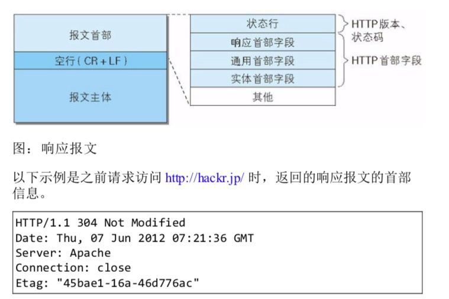

## HTTP 首部字段传递重要信息

HTTP 首部字段是构成 HTTP 报文的要素之一。在客户端与服务器之间以 HTTP 协议进行通信的过程中，无论是请求还是响应都会使用首部字段，它能起到传递额外重要信息的作用。

使用首部字段是为了给浏览器和服务器提供报文主题大小、所使用的语言、认证信息等内容。

### http 首部段结构
HTTP 首部字段是由首部字段名和字段值构成的，中间用冒号":"分割
```bash
# 首部字段名: 字段值
Content-Type: text/html # 表示报文主题的对象类型
Keep-Alive: timeout=15, max=100 # 字段值对应单个 HTTP首部字段可以有多个值
```

> 当 HTTP 报文首部中出现了两个或两个以上具有相同首部字段名时会怎么样呢？
> 这种在规范内尚未明确，根据铃兰起内部处理逻辑的不同，结果可能并不一致，有些浏览器会优先处理第一次出现的首部字段，而有些则会优先处理最后出现的首部字段

HTTP 首部字段根据实际用途被分为以下4中类型

* 通用首部字段（General Header Fields）
请求报文和响应报文两方都会使用的首部

* 请求首部字段（Request Header Fields）
从客户端向服务器端发送请求报文时使用的首部。补充了请求的附加内容、客户端信息、响应内容相关优先级等信息。

* 响应首部字段 （Response Header Fields）
从服务器端向客户端返回响应报文时使用的首部。补充了响应的附加内容，也会要求客户端附加额外的内容信息。

* 实体首部字段（Entity Header Fields）
针对请求报文和响应报文的实体部分使用的首部。补充了资源内容更新时间等与实体有关的信息。

### End-to-end 首部和 Hop-to-hop 首部

端到端首部
分在此类别中的首部会转发给请求/响应对应的最终接收目标，且必须保存在由缓存生成的响应中，另外规定它必须被转发。

逐跳首部
分在此类别中的首部只对单次转发有效，会因通过缓存或代理不再转发。在http/1.1和之后的版本中，如果要使用hop-by-hop首部，需要提供 Connection 首部字段

除这 8 个首部字段外，其他说有字段都属于端到端首部。
* Connection
* Keep-Alive
* Proxy-Authenticate
* Proxy-Authorization
* Trailer
* TE
* Transfer-Encoding
* Upgrade

## HTTP/1.1 通用首部字段
通用首部字段是指，请求报文和响应报文双方都会使用的首部。

### Cache-Control
通过指定首部字段 Cache-Control的指令，就能操作缓存的工作机制。

指令的参数是可选的，多个指令之间通过"，"分割。首部字段 Cache-Control 的指令可用于请求及响应时。
```bash
Cache-Control: private, max-age=0, no-cache
```

* Cache-Control指令一览
 
 缓存请求指令
 
 |指令|参数|说明|
 |:---|:---|:---|
 |no-cache|无|强制向源服务器再次验证|
 |no-store|无|不缓存请求或响应的任何内容|
 |max-age=[秒]|必需|响应的最大Age值|
 |max-stale(=[秒])|可省略|接收已过期的响应|
 |min-fresh=[秒]|必需|期望在指定时间内的响应仍有效|
 |no-transform|无|代理不可更改媒体类型|
 |only-if-cached|无|从缓存获取资源|
 |cache-extension|-|新指令标记（token）|

缓存响应指令

|指令|参数|说明|
|:---|:---|:---|
|public|无|可向任意方向提供响应的缓存|
|private|可省略|仅向特定用户返回响应|
|no-cache|可省略|缓存前必须先确认其有效性|
|no-store|无|不缓存请求或响应的任何内容|
|no-transform|无|代理不可更改媒体类型|
|must-revalidate|无|可缓存但必须向源服务器进行确认|
|proxy-revalidate|无|要求中间缓存服务器对缓存的响应有效性再进行确认|
|max-age=[秒]|必需|响应的最大Age值|
|s-maxage=[秒]|必需|公共缓存服务器响应的最大Age值|
|cache-extension|-|新指令标记（token）|

* 表示是否能缓存的指令

public 指令
```bash
Cache-Control: public # 当指定使用 public 指令时，则明确表明其他用户也可利用缓存
```

private 指令 
```bash
Cache-Control: private # 当指定 private 指令后，响应只以特定的用户作为对象，这与public指令的行为相反
```
缓存服务器会对该特定用户提供资源缓存的服务，对于其他用户发送过来的请求，代理服务器则不会返回缓存

no-cache 指令 
```bash
Cache-Control: no-cache # 目的是为了防止从缓存中返回过期的资源。
```
客户端发送的请求中如果包含 no-cache 指令，则表示客户端将不会接收缓存过的响应。于是，"中间"的缓存服务器必须把客户端请求转发给源服务器。

如果服务器返回的响应中包含 no-cache 指令，那么缓存服务器不能对资源进行缓存。源服务器以后也将不再对缓存服务器请求中提出对资源有效性进行确认，且禁止其对响应资源进行缓存操作

```bash
Cache-Control: no-cache=Location
```
由服务器返回的响应中，若报文首部字段 Cache-Control 中对 no-cache 字段名具体指定参数值，那么客户端在接收到这个被指定参数值的首部字段对应的响应报文后，就不能使用缓存。换言之，无参数的首部字段可以使用缓存。只能在响应指令中指定该参数

* 控制可执行缓存对象的指令
```bash
Cache-Control: no-store # 当使用no-store指令时，暗示请求（和对应的响应）或响应中包含机密信息。 no-store才算真正的不进行缓存，因此该指令规定不能在本地存储请求或响应的任一部分。
```

* 指定缓存期限和认证的指令
 s-maxage 指令
 ```bash
Cache-Control: s-maxage=604800 (单位: 秒)
```
s-maxage 指令的功能和 max-age 指令相同，它们的不同点是 s-maxage 指令只适用于供多位用户使用的公共缓存服务器。也就是说，对于向同一用户重复返回响应的服务器来说，这个指令没有任何作用。

另外，当使用 s-maxage 指令后，则直接忽略对 Expires 首部字段 和 max-age 指令的处理

max-age 指令

 ```bash
Cache-Control: max-age=604800 (单位: 秒)
```
当客户端发送的请求中包含 max-age 指令时，如果判定缓存资源的缓存时间数值比指定时间的数值更小，那么客户端就接收缓存的资源。另外，当指定 max-age 值为 0，那么缓存服务器通常需要将请求转发给源服务器

当服务器返回的响应中包含 max-age 指令时，缓存服务器将不对资源的有效性再作确认，而 max-age 数值代表资源保存为缓存的最长时间。

应用HTTP/1.1版本 的缓存服务器遇到同时存在的 Expires 首部字段的情况时，会优先处理 max-age 指令，而忽略掉 Expires 首部字段。而HTTP/1.0 版本的缓存服务器的情况却相反，max-age 会被忽略掉。

min-fresh 指令
 ```bash
Cache-Control: min-fresh=60 (单位: 秒)
```
min-fresh 指令要求缓存服务器返回至少还未过指定时间的缓存资源。比如，当指定 min-fresh 为 60s 后，过了60s的资源都无法作为响应返回了。

max-stale 指令
```bash
Cache-Control: max-stale=3600 (单位: 秒) # 使用 max-stale 可指示缓存资源，即使过期也照常接收。
```

如果指令未指定参数值，那么无论经过多久，客户端都会接收响应；如果指令中指定了具体数值，那么即使过期，只要仍处于 max-stale 指定的时间内，仍旧会被客户端接收

only-if-cached 指令
 ```bash
Cache-Control: only-if-cached
```
使用 only-if-cached 指令表示客户端仅在缓存服务器本地缓存目标资源的情况下才会要求其返回。换言之，该指令要求缓存服务器不重新加载响应，也不会再次确认资源有效性。若发生请求资源服务器的本地缓存无响应，则返回状态码504 Gateway Timeout

must-revalidate 指令
 ```bash
Cache-Control: must-revalidate # 代理会向源服务器再次验证即将返回的响应缓存目前是否仍然有效
                               # 若代理无法连通源服务器再次获取有效资源的话，缓存必须给客户端一条 504（Gateway Timeout）状态码。
                               # 另外，使用了must-revalidate 指令会忽略请求的 max-stale 指令（即使已经在首部使用了 max-stale，也不会再有效果）
```

proxy-revalidate 指令
 ```bash
Cache-Control: proxy-revalidate # 该指令要求所有的缓存服务器在接收到客户端带有该指令的请求返回响应之前，必须再次验证缓存有效性。
```

no-transform 指令
 ```bash
Cache-Control: no-transform # 使用 no-transform 指令规定无论是在请求还是响应中，缓存都不能改变实体主题的媒体类型。这样做可防止缓存或代理压缩图片等类似操作
```

#### Cache-Control 扩展
cache-extension token
 ```bash
Cache-Control: private, community="UCI" # 通过 cache-extension 标记（token），可以扩展 Cache-Control 首部字段内的指令。
                                        # Cache-Control 首部字段本身没有community指令。借助extension tokens 实现了该指令的添加。如果缓存服务器不能理解 community 这个新指令，就会直接忽略。因此，extension tokens 仅对能理解它的缓存服务器来说是有意义的。
```

### Connection

Connection 首部字段具备如下两个作用
* 控制不再转发给代理的首部字段

 ```bash
Connection: 不再转发的首部字段名
```
在客户端发送请求和服务器返回响应内，使用 Connection 首部字段，可控制不再转发给代理的首部字段（即Hop-by-hop首部）。
* 管理持久连接
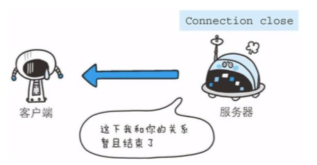

 ```bash
Connection: close # HTTP/1.1版本默认连接都是持久连接，为此，客户端会在持久连接上连续发送请求。当服务器端想明确断开连接时，则指定 Connection 首部字段值为close
Connection: Keep-Alive # HTTP/1.1之前的HTTP 版本默认连接都是非持久连接。为此，如果想在旧版本的HTTP协议上维持持续连接，则需要指定Connect 首部字段为 Keep-Alive
```


 图一客户端发送请求给服务端，服务端会像图二那样加上首部字段 Keep-Alive 及首部字段 Connection 后返回响应。
 

### Date
首部字段 Date 表明创建 HTTP 报文的日期和时间。
```bash
Date: Mon, 16 Sep 2019 08:46:12 GMT # HTTP/1.1 协议使用在 RFC1123 中规定的日期时间的格式
Date: Mon, 16-Sep-19 08:46:12 GMT # 之前的 协议使用在 RFC850 中规定的日期时间的格式
Date: Mon Sep 03 08:46:12 2019 # c标准库内的asctime() 函数的输出格式一致。
```
 ### Pragma
 
 Pragma 是 HTTP/1.1 之前的版本的历史遗留字段，仅作为与 HTTP/1.0的向后兼容而定义。
 
 规范定义的形式唯一
 ```bash
Pragma: no-cache # 该字段属于通用首部字段，但只用在客户端发送但请求中。客户端会要求所有的中间服务器不返回缓存的资源。
```


所有的中间服务器如果都能以 HTTP/1.1 为基准，那直接采用 Cache-Control: no-cache 指定缓存的处理方式是最为理想的。但要整体掌握全部中间服务器使用的HTTP协议版本却是不现实的。因此，发送的请求会同时含有下面两个首部字段。

 ```bash
Cache-Control: no-cache
Pragma: no-cache
```

### Trailer
首部字段 Trailer 会事先说明在报文主体后记录了哪些首部字段。该首部字段可应用在 HTTP/1.1 版本分块传输编码时。


### Transfer-Encoding

首部字段 Transfer-Encoding 规定了传输报文主体时采用的编码方式。

HTTP/1.1 的传输编码方式仅对分块传输编码有效。


### Upgrade
首部字段 Upgrade 用于检测 HTTP 协议及其他协议是否可使用更高版本进行通信，其参数值可以用来指定一个完全不同的通信协议


上图用例中，首部字段 Upgrade 指定的值为 TLS/1.0。 请注意此处两个字段首部字段的对应关系，Connection 的值被指定为 Upgrade。Upgrade 首部字段产生作用的 Upgrade 对象仅限于客户端和邻接服务器之间。因此，使用首部字段 Upgrade时，还需要额外指定Connection: Upgrade

对于附有首部字段 Upgrade的请求，服务器可用 101 Switching Protocols 状态码作为响应返回。

### Via

使用首部字段 Via是为了追踪客户端和服务器之间的请求和响应报文的传输路径。

报文经过代理或网关时，会先在首部字段 Via 中附加该服务器的信息，然后再进行转发。这个做法和 Traceroute 及电子邮件的 received 首部工作机制很相似

首部字段 Via 不仅用于追踪报文的转发，还可避免请求回环的发生，所以必须在经过代理时附加该首部字段内容。

上图示例中，在经过代理服务器 A时，Via首部附加了 "1.0 gw.hackr.jp(Squid/3.1)"这样的字符串值。行头的1.0 是指接收请求的服务器上应用的 HTTP 协议版本。接下来经过代理服务器 B 时，亦是在Via 首部附加服务器信息，也可增加新的 Via 首部写入服务器信息。

Via 首部是为了追踪传输路径，所以经常会和 TRACE 方法一起使用。比如，代理服务器接收到由 TRACE 方法发送过来的请求（其中 Max-Forwards:0）时，代理服务器就不能再转发该请求了。这种情况下，代理服务器会将自身的信息附加到 Via首部后，返回该请求的响应

### Warning


## 请求首部字段

请求首部字段是从客户端往服务器端发送请求报文中所使用的字段，用于补充请求的附加信息、客户端信息、对响应内容相关的优先级等内容。

### Accept
Accept 首部字段可通知服务器，用户代理能够处理的媒体类型及媒体类型的相对优先级。可使用 type/subtype 这种形式，一次指定多种媒体类型。
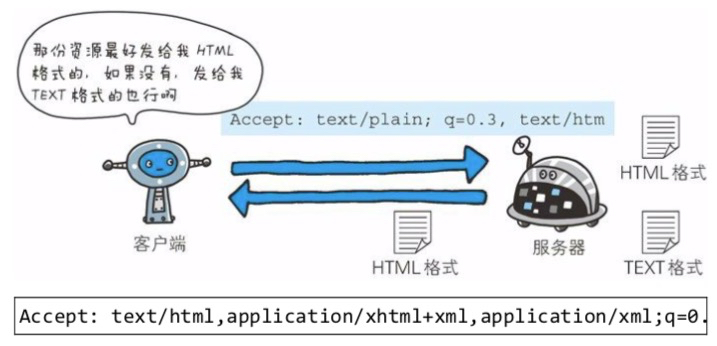

下面我们试举 几个媒体类型的例子 

* 文本文件
text/html, text/plain, text/css ...

application/xhtml+xml, application/xml ...

* 图片文件
image/jpeg, image/gif, image/png, image/webp, image/apng...
webp 保证图片质量的情况下，图片的体积更小

Apng格式是Png的动态形式，是png的扩展，支持半透明，没有锯齿问题，效果上更好。有损压缩后体积比gif小30%，而且没有锯齿
缺点：兼容性差，目前只有firefox和opera支持，还有IOS下的safari，但是不支持的应用程序会显示Apng的第一帧

* 视频文件
video/mpeg, video/quicktime ...

* 应用程序使用的二进制文件
application/octet-stream, application/zip ...

比如，如果浏览器不支持 PNG 图片的显示，那Accept 就不指定 image/png，而指定可处理的 image/gif 和image/jpeg 等图片类型。

若想要给显示的媒体类型增加优先级，则使用 `q=` 来额外表示权重值，用分号（；）进行分割。权重值 `q` 的范围是 0～1（可精确到小数点后三位），且 1 为最大值。不指定权重 `q`值，默认`q=1.0`(q qvalue quality factor 权重值)

当服务器提供多种内容时，将会首先返回权重值最高当媒体类型。

### Accept-Charset


* 该首部字段应用于内容协商机制的服务器驱动协商。

### Accept-Encoding


* gzip
由文件压缩程序 gzip（GNU zip）生成的编码格式（RFC1952）， 采用 Lempel-Ziv算法（LZ77）及32位循环冗余校验（Cyclic Redundancy Check，通称 CRC）。

* compress 
由 UNIX 文件压缩程序 compress 生成的编码格式，采用 Lempel-Ziv-Welch 算法（LZW）

* deflate
组合使用 zlib 格式（RFC1950）及由 deflate 压缩算法（RFC1951）生成的编码格式。

* identity

不执行压缩或不会变化的默认编码格式

采用权重 `q` 值来表示相对优先级，这点与首部字段 `Accept` 相同。另外，也可使用星号（*）作为通配符，指定任意的编码格式

### Accept-Language


### Authorization


### Expect
417 Expect: 100-continue
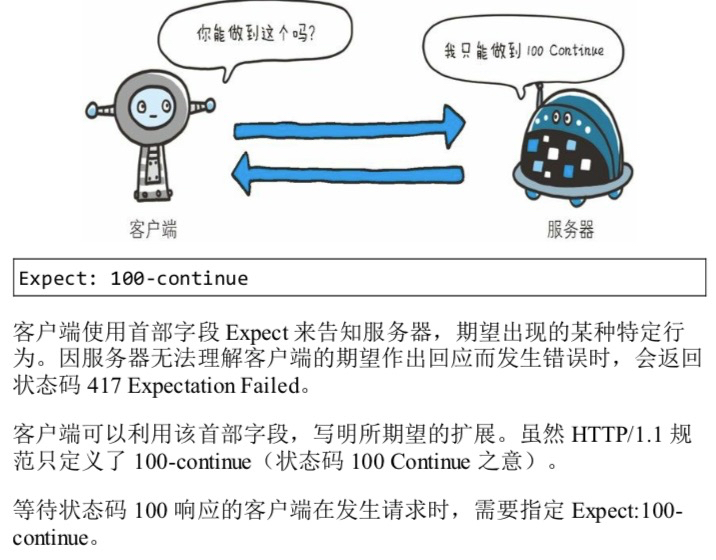

### From


首部字段From用来告知服务器使用用户代理的用户的电子邮箱地址。通常，其使用目的是为了显示搜索引擎等用户代理的负责人的电子邮箱联系方式。使用代理时，应尽可能包含 From 首部字段（但可能会因代理不同，将电子游戏地址记录在 User-agent 首部字段）

### Host
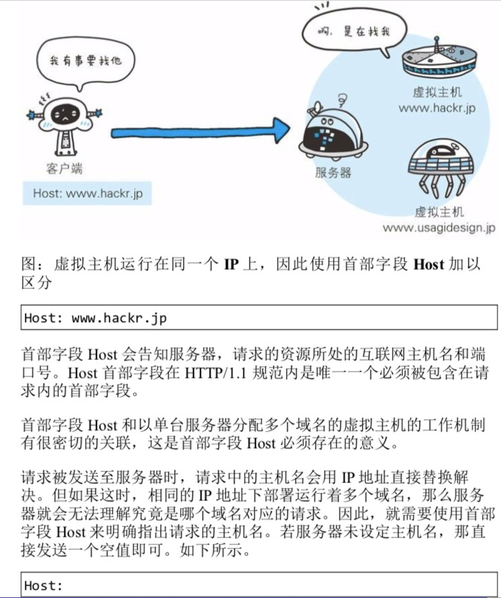

### If-Match


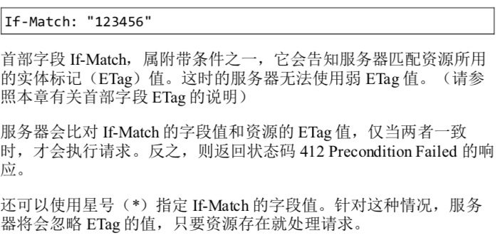

### If-Modified-Since


### If-None-Match


### If-Range


### If-Unmodified-Since

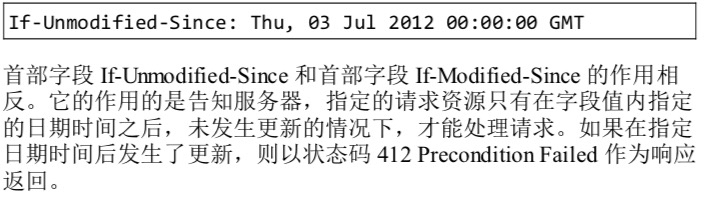

### Max-Forwards

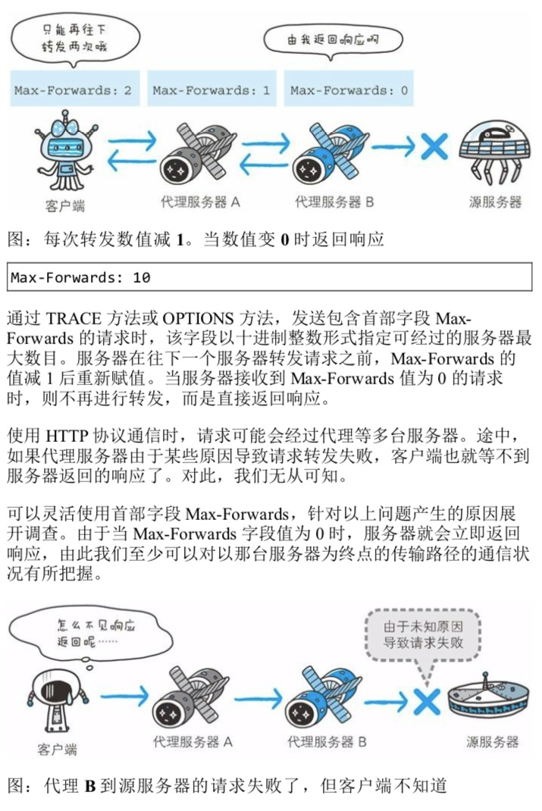


### Proxy-Authorization


### Range

```bash
Range: bytes=5001-10000
```

对于只需获取部分请求资源范围请求，包含首部字段 Range 即可告知服务器资源的指定范围。上面的示例表示请求获取从第 5001 字节至 10000 字节的资源。

接收到附带 Range 首部字段请求的服务器，会在处理请求之后返回状态码为 206 Partial Content 的响应。无法处理该范围请求时，则会返回状态码200 OK的响应及全部资源。

### Referer

```bash
Referer: http://www.hackr.jp/index.htm
```
首部字段 Referer 会告知服务器请求的原始资源的URI

客户端一般都会发送 Referer 首部字段给服务器。但当直接在浏览器的地址栏输入 URI， 或处于安全性的考虑时，也可以不发送该首部字段。

因为原始资源的 URI 中的查询字符串可能含有 ID 和密码等保密信息，要是写进 Referer 转发给其他服务器，则有可能导致保密信息泄露。

另外，Referer的正确拼写是 Referrer ，但是却一直沿用错误拼写

### TE
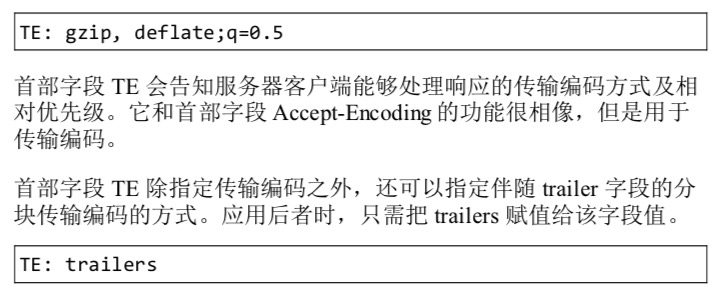
```bash
TE: trailers
```
### User-Agent
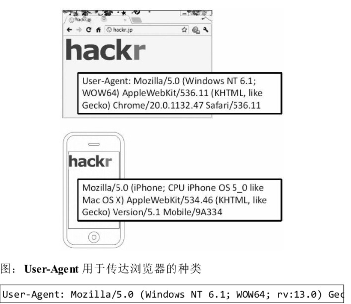

首部字段 User-Agent 会将创建请求的浏览器和用户代理名称等信息传达给服务器。

由网络爬虫发起请求时，有可能会在字段内添加爬虫作者等电子邮箱地址。此外，如果请求经过代理，那么中间也很可能被添加上代理等服务器的名称。

## 响应首部字段

响应首部字段由服务器端向客户端返回响应报文中所使用的字段，用于补充响应的附加信息、服务器信息，以及对客户端的附加要求等信息

### Accept-Ranges


```bash
Accept-Ranges: bytes # 可处理范围请求时
Accept-Ranges: none # 当不能处理范围请求时
```

### Age


### ETag
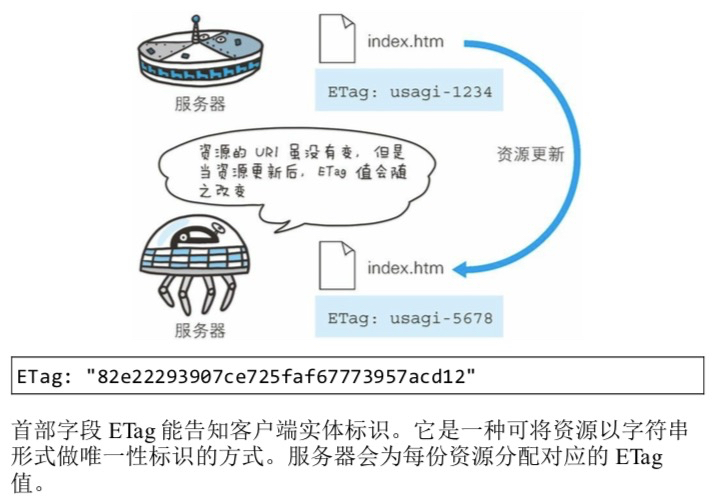
当资源更新时，ETag 值也需要更新。生成 ETag 值时，并没有统一的算法规则，而仅仅由服务器来分配。


### Location
 

### Proxy-Authenticate
```bash
Proxy-Authenticate: Basic realm="Usagidesign Auth"
```
 

### Retry-After
 
 
### Server

```bash
Server: Apache/2.2.17 (Unix)
```
首部字段 Server 告知客户端当前服务器上安装的 HTTP 服务器的应用程序的信息。不单单会标出服务器上的软件应用名称，还有可能包括版本号和安装时启用的可选项
```bash
Server: Apache/2.2.6(Unix) PHP/5.2.5
```

### Vary
 
 

### WWW-authenticate

 
 
## 实体首部字段

实体首部字段是包含在请求报文和响应报文中的实体部分所使用的首部，用于补充内容的更新时间等与实体相关的信息。

### Allow
 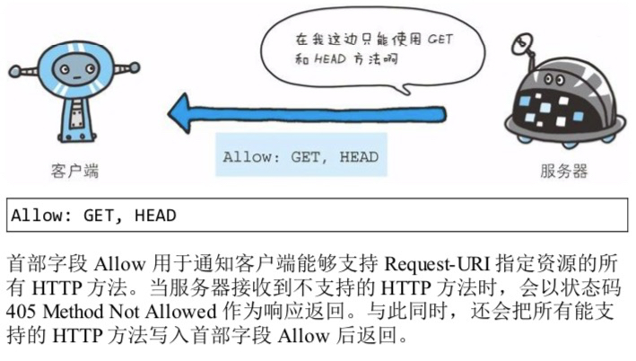

 ### Content-Encoding
  
* gzip
* compress
* deflate
* identity

### Content-Language

 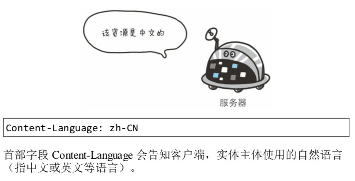

### Content-Length


### Content-Location


### Content-MD5

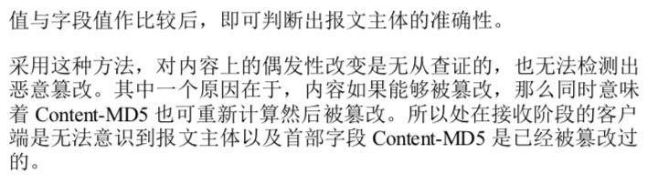

### Content-Range
 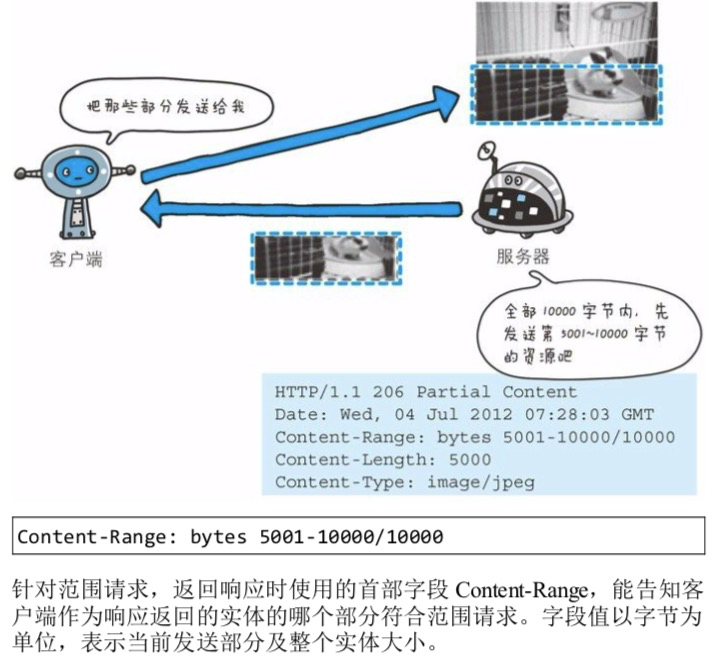

### Content-Type
```bash
Content-Type: text/html; charset=UTF-8
```
首部字段 Content-Type 说明了实体主体内对象的媒体类型。和首部字段 Accept 一样，字段值用 type/subtype 形式赋值。

参数 charset 使用 iso-8859-1 或 euc-jp 等字符集进行赋值

### Expires


### Last-Modified


## 为 Cookie 服务的首部字段（p128）
|首部字段名|说明|首部类型|
|:---|:---|:---|
|Set-Cookie|开始状态管理所使用的Cookie信息|响应首部字段|
|Cookie|服务器接收到的Cookie信息|请求首部字段|

### Set-cookie

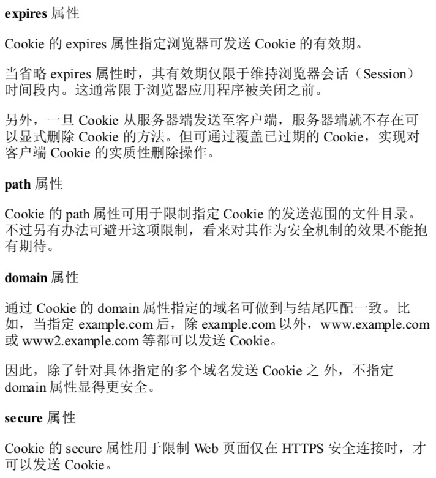


### Cookie
```bash
Cookie: status=enable
```
首部字段 Cookie会告知服务器，当客户端想获得 HTTP 状态管理支持时，就会在请求中包含从服务器接收到的 Cookie。接收到多个 Cookie 时，同样可以以多个 Cookie 形式发送

## 其他首部字段

HTTP 首部字段是可以自行扩展到。所以在 Web 服务器和浏览器应用上，会出现各种非标准的首部字段。（`协议对X-前缀废除，但对已经在使用中X-前缀，不应该要求其变更`）

### X-Frame-Options
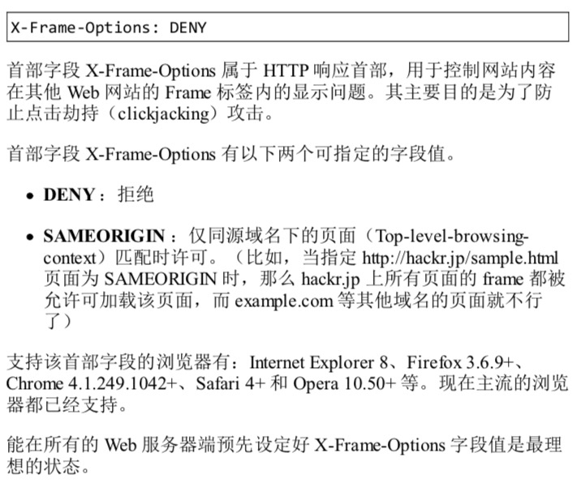

对 apache2.conf 的配置实例
```bash
<IfModule mod_headers.c>
  Header append X-FRAME-OPTIONS "SAMEORIGIN"
</IfModule>
```
### X-XSS-Protection
```bash
X-XSS-Protection: 1 # 属于HTTP 响应首部，它是针对跨站脚本（XSS）的一种对策，用于控制浏览器 XSS 防护机制的开关。

# 0： 将 XSS 过滤设置成无效状态
# 1： 将 XSS 过滤设置成有效状态
```
### DNT


### P3P
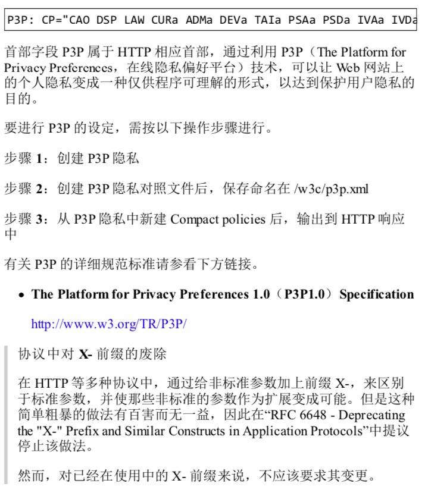
