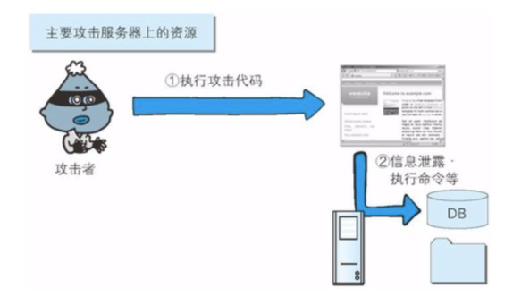
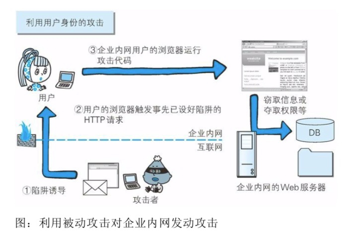
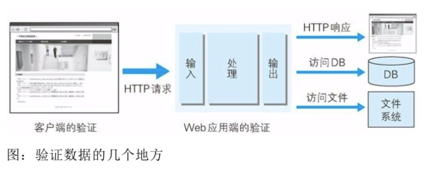

# web攻击技术

## HTTP 不具备必要的安全功能
## 在客户端即可篡改请求

## 针对 Web 应用的攻击模式

### 主动攻击

### 被动攻击

* 以服务器为目标的主动攻击
主动攻击（active attack）是指攻击者通过直接访问 Web 应用，把攻击代码传入的攻击模式。由于该模式是直接针对服务器上的资源进行攻击，因此攻击者需要能够访问到那些资源。

主动攻击模式里具有代表性的攻击是 SQL 注入攻击和 OS 命令注入攻击。

图，主动攻击

* 以服务器为目标的被动攻击

被动攻击（passive attack）是指利用圈套策略执行攻击代码的攻击模式。在被动攻击过程中，攻击者不直接对目标 Web 应用访问发起攻击。

被动攻击通常的攻击模式如下所示。
1. 攻击者诱使用户触发已设置好的陷阱，而陷阱会启动发送已嵌入攻击代码的 HTTP 请求。
2. 当用户不知不觉中招之后，用户的浏览器或邮件客户端就会触发这个陷阱。
3. 中招后的用户浏览器会把含有攻击代码的 HTTP 请求发送给作为攻击目标的 Web 应用，运行攻击代码。
4. 执行完攻击代码，存在安全漏洞的 Web 应用会成为攻击者的跳板，可能导致用户所持的Cookie等个人信息被窃取，登录状态中的用户权限遭恶意滥用等后果。

被动攻击模式中，具有代表性的攻击是跨站脚本攻击和跨站点请求伪造。

图，被动攻击

利用用户的身份攻击企业内部网络

利用被动攻击，可发起对原本从互联网上无法直接访问的企业内网等网络的攻击。只要用户踏入攻击者预先设好的陷阱，在用户能够访问到的网络范围内，即使是企业内网也同样会受到攻击。

很多企业内网依然可以连接到互联网上，访问 Web 网站，或接收互联网发来的邮件。这样就可能给攻击者可乘之机，诱导用户触发陷阱后对企业内网发动攻击。

## 因输出值转义不完全引发的安全漏洞

实施 Web 应用的安全对策可大致分为以下两部分。

* 客户端的验证
* web 应用端（服务端）的验证
  * 输入值验证
  * 输出值转义
  

多数

