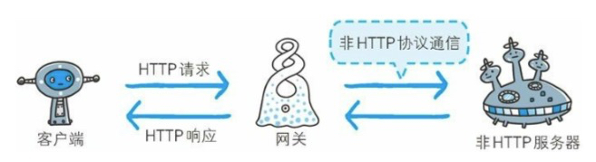
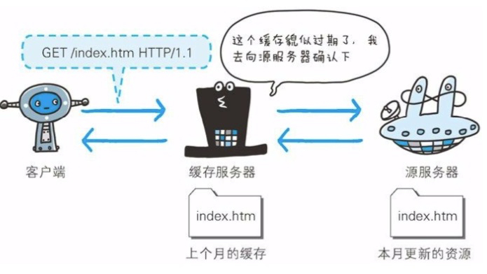

# 代理、网关、隧道
## 代理
* 代理服务器的基本行为就是接收客户端发送的请求后转发给其他服务器。代理不改变请求 URI，会直接发送给前方持有资源的目标服务器。
* 持有资源实体服务器被成为源服务器。从源服务器返回的响应经过代理服务器后再传给客户端。

图：每次通过代理服务器转发请求或响应时，会追加写入 Via 首部信息

在 HTTP 通信过程中，可级联多台代理服务器，请求和响应的转发会经过多台类似锁链一样连接起来的代理服务器。转发时，需要附加 Via首部字段以标记出经过的主机信息。

* 通过设置组织内部的代理服务器可做到针对特定 URI 访问的控制

使用代理服务器的理由有：利用缓存技术（稍后讲解）减少网络带宽的流量，组织内部针对特定网站的访问控制，以获取访问日志为主要目的，等等。

代理有多种使用方法，按两种基准分类。一种是是否使用缓存，另一种是是否会修改报文

* 缓存代理
代理转发响应时，缓存代理（Caching Proxy）会预先将资源的副本（缓存）保存在代理服务器上，当代理再次接收到对相同资源的请求时，就可以不从源服务器那里获取资源，而是将之前缓存的资源作为响应返回

* 透明代理
转发请求或响应时，不对报文做任何加工的代理类型被称为透明代理（Transparent Proxy）。反之，对报文内容进行加工的代理被称为非透明代理。
## 网关

图：利用网关可以由 HTTP 请求转化为其他协议通信

网关的工作机制和代理十分相似。而网关能使通信线路上的服务器提供非 HTTP 协议服务。

利用网关能提高通信的安全性，因为可以在客户端与网关之间的通信线路上加密以确保链接的安全。比如，网关可以连接数据库，使用 SQL 语句查询数据。另外，在web 购物网站上进行信用卡结算时，网关可以和信用卡结算系统联动。

## 隧道
隧道可按要求建立起一条与其他服务器的通信线路，届时使用 SSL 等加密手段通信。隧道的目的是确保客户端与服务器进行安全的通信

* 隧道本身不会去解析 HTTP 请求。也就是说，请求保持原样中转给之后的服务器。隧道会在通信爽翻断开连接时结束。

图：通过隧道的传输，可以远距离的和服务器安全通信。隧道本身是透明的，客户端不用在意隧道的存在

## 保存资源的缓存

缓存是指代理服务器或客户端本地磁盘内保存的资源副本。利用缓存可减少对源服务器的访问，因此也就节省了通信流量和通信时间。

缓存服务器是代理服务器的一种，并归类在缓存代理类型中。换句话说，当代理转发从服务器返回当响应时，代理服务器就会保存一份资源的副本。

缓存服务器的优势在于利用缓存可避免多次从源服务器转发资源。因此客户端可就近从缓存服务器上获取资源，而源服务器也不必多次处理相同的请求了。

## 缓存的有效期限

即使存在缓存，也会因为客户端的要求、缓存的有效期等因素，向源服务器确认资源的有效性。若判断缓存失效，缓存服务器将再次从源服务器上获取"新"资源。

## 客户端的缓存

缓存不仅可以存在缓存服务器内，还可以存在客户端浏览器中。以 Internet Explorer 程序为例，把客户端缓存成为临时网络文件（Temporary Internet File）。

浏览器缓存如果有效，就不必再像服务器请求相同的资源了，可以直接从本地磁盘内读取。
另外，和缓存服务器相同的一点是，当判定缓存过期后，会向源服务器确认资源的有效性。若判定浏览器缓存失效，浏览器会再次请求新资源。

