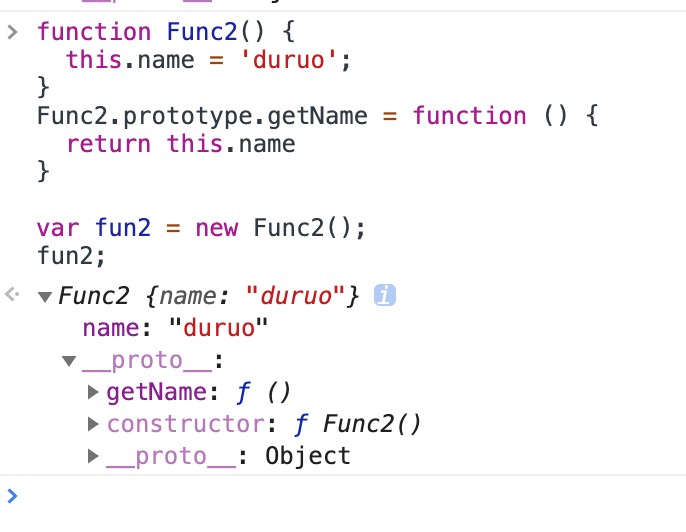

# 常见需求总结
## 检测下拉到底部
```js
$(document).ready(function() {
  var nScrollHight = 0; //滚动距离总长
  var nScrollTop = 20;   //滚动到的当前位置
  var nDivHight = 500;
  $(".box").scroll(function(){
    nScrollHight = $(this)[0].scrollHeight;
    nScrollTop = $(this)[0].scrollTop;

    if(nScrollTop + nDivHight >= nScrollHight)
      alert("滚动条到底部了");
  });
});
```
## 弹窗下拉加载数据

```html
<div class="body">
  <div class="popup">
    <div class="item"></div>
    <div class="item"></div>
    <div class="item"></div>
    <div class="item"></div>
    <div class="item"></div>
    <div class="item"></div>
  </div>
</div>
```
```css
.body {
    max-height: 200px;
    padding: 10px 26px;
    overflow: scroll;
}
```
```js
var pn = 1;
var limitTotal = '';
window.getData = function () {
        query.getData(pn).then(function (result) {
          if (result.state === 'ok') {
            limitTotal = Math.ceil(result.data.count / 10);
            var items = result.data.items;
            $('.popup').append(items);

            if (unitPn < limitTotal) {
              unitPn++;
              $(".body").unbind("scroll").bind("scroll",window.dropDownRefresh);
            } else {
              $('.body').unbind("scroll", window.dropDownRefresh);
            }
          } else {
          }
      });
    };
// 检测下拉到底部
    window.dropDownRefresh = function (e) {
      var scrollTop = $(this).scrollTop();
      var scrollHeight = $(this).height();
      var windowHeight = $('.popup').height();
      if ((scrollTop + scrollHeight) >= windowHeight) {
        $('.body').unbind("scroll", window.dropDownRefresh);
        window.getData();
      }
    };
```
## js构造函数里的方法和prototype上定义方法的区别

```js
function Func1() {
  this.name = 'duruo';
  this.getName = function () {
    return this.name;
  }
}
var fun1 = new Func1();
fun1;

```


```js
function Func2() {
  this.name = 'duruo';
}
Func2.prototype.getName = function () {
  return this.name
}

var fun2 = new Func2();
fun2;
```



两者区别
1. 构造函数内的方法在构造函数内，prototype上的方法在原型链上；
2. prototype上的变量和方法是不被序列化的`(对象序列化是指将对象的状态转换为字符串)`
3. 不加.prototype的话, 每一个对象都会拥有该方法的一份拷贝,造成内存浪费,加上.prototype可以保证所有实例对象共享一份方法


