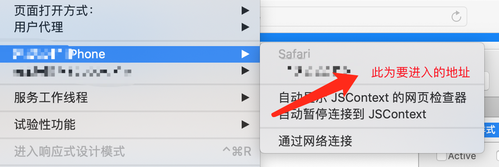
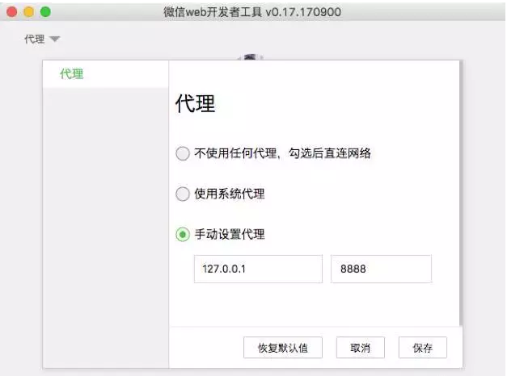
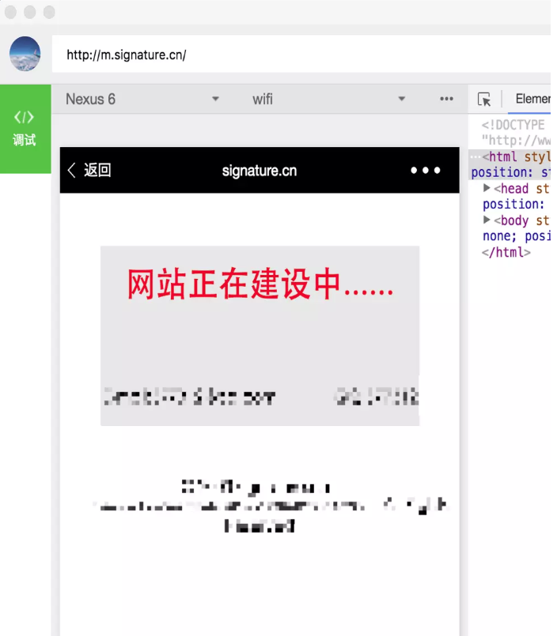

### 前端｜本地调试H5页面方案总结

> 参考 https://www.jianshu.com/p/a43417b28280

## 简单网络、APP环境的调试
#### 讲述h5页面在app中，即webview的调试方法
##### H5调用了App的jsBridge接口,则此H5页面只能在此App里打开
* chrome://inspect/#devices

### 1. 通过Chrome调试安卓机上的H5页面  *实践*
    1. 安装Chrome 32或者之后的版本
    2. 使用USB线将安卓机和Mac连接起来
    3. 打开 USB 调试选项在安卓设备上，进入设置>开发者选项>打开USB调试 (注意：在安卓 4.2 及以后的版本中，默认情况下开发者选项是隐藏的。要启用开发者选项，选择设置>关于手机然后点击版本号7次。)。
    4. 在电脑端的Chrome里，在地址栏输入chrome://inspect#device。进入后确认Discover USB devices已经勾选了：

     

     5. 在你的设备上，打开要浏览的页面,会跳出一个弹框，询问你是否要允许在电脑端进行USB调试。选择确定。

      

     6. 点击chrome://inspect/#devices 页面上的inspect便可以审查安卓机上的H5页面的元素了

      

* 有时候不弹出是否允许USB调试
进入开发者模式→点击“撤销USB调试授权”→确认，之后重新连接电脑（重新插拔USB数据线）

### 2. 通过Safari调试iPhone上的H5页面 *实践*
    1. 运行Safari,点击“Safari”菜单下面的“偏好设置（Preferences...）”，切换到“高级选项（Advanced）”：
勾选在菜单栏中显示开发菜单

    

    2. 勾选“在菜单栏显示"开发"菜单（ShowDevelop menu in menu bar）”，关闭偏好设置。此时在Safari的工具栏出现“开发（Develop）”菜单：

    

    3. 使用USB线将iPhone和Mac连接起来
    mac需要设置开发者模式
    在设置===> safari浏览器 ===> 高级 ===> JavaScript、网页检查器（选中）

    4. 在iPhoneSafari打开要调试的H5页面,便可以调试了

    

    

## 复杂网络、app环境的调试

__需求__:

在微信中调试H5页面的微信分享功能,http://m.signature.cn数字签名生成服务使用https协议通信(比如 https://io.signature.cn),数字签名服务只允许*.signature.cn访问

__难点__:

1. 必须在*.signature.cn环境下进行调试,否则无法访问用来签名的https://io.signature.cn服务
2. io.signature.cn服务使用https协议通信,中间难以通过代理拦截
3. 分享相关微信jsBridge接口,只在微信App中存在,无法在本地开发环境调用

__解决办法(适用于Mac)__:

1. 下载安装微信Web开发者工具，从这里https://mp.weixin.qq.com/debug/wxadoc/dev/devtools/download.html

2. 下载并安装 Charles，从这里http://xclient.info/s/charles.html

3. 打开Charles，按如图所示方式安装根证书

    

4. 在Proxy -> SSL Proxying Settings 中，加入 *.signature.cn 域名

    

5. 在Tools ->  Map Local 功能中，加入需要代理到本地的线上 URL 到 本地文件夹的对应关系

    

6. 在微信开发者工具中，设置代理到 Charles 端口

    

7. 在微信开发者工具中，打开线上地址，可以看到 JS 文件已经被替换，这时候可以在同时有线上 API 和微信 jsBridge 的环境下进行调试

    

    --------------------------更新--------------------------
## 调试工具还有xcode和微信web开发者工具（上文讲的是微信开发者工具，两者不同）

1. xcodeXcode
    xcodeXcode 是运行在操作系统Mac OS X上的集成开发工具（IDE），由苹果公司开发。Xcode是开发OS X和iOS应用程序的最快捷的方式。

    它有iOS系统模拟器，能够结合上边的用Safari调试iPhone手机上的页面的方式调试模拟器中任何app打开的页面。

    以钉钉调试为例，请看文档  钉钉调试文档

    

    
2. 微信web开发者工具

    下载链接：[微信web开发者工具下载链接](https://mp.weixin.qq.com/wiki?t=resource/res_main&id=mp1455784140)   （这个链接还真不好找，百度 bing搜到的结果都是微信开发者工具的下载链接）

    

    如图，这是一个非常强大的工具，即可以调试安卓手机的页面也可以调试iOS手机上的页面，，，用这个工具可以调试各浏览器上的页面，微博里的h5页面或者QQ客户端里的h5页面

