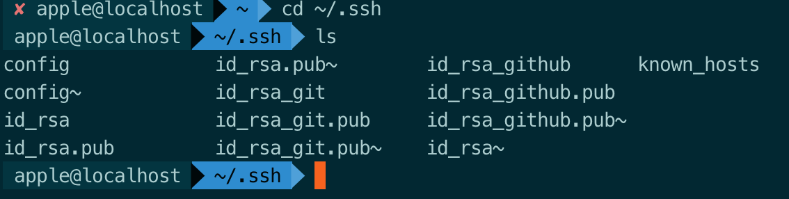

# git 用法

## 管理git生成的多个ssh key

> [来自简书](https://www.jianshu.com/p/f7f4142a1556)
### 问题阐述

* 当有多个git账号的时候，比如一个github，用于自己进行一些开发活动，再来一个gitlab，一般是公司内部的git。这两者你的邮箱如果不同的话，就会涉及到一个问题，生成第二个git的key的时候会覆盖第一个的key，导致必然有一个用不了。

### 问题解决

* 我们可以在~/.ssh目录下新建一个config文件配置一下，就可以解决问题


### 具体步骤

* 生成第一个ssh key(这里我用于github，用的gmail邮箱)
```bash
ssh-keygen -t rsa -C "yourmail@gmail.com"
```
    这里不要一路回传，让你选择在哪里选择存放key的时候写个名字，比如 id_rsa_github，之后的两个可以回车。
完成之后我们可以看到~/.ssh目录下多了两个文件
    ~/.ssh目录下的文件
```bash

```


* 生成第二个ssh key（这里我用于gitlab，用的是公司邮箱）
```bash
ssh-keygen -t rsa -C "yourmail@gmail.com"
```


还是一样不要一路回车，在第一个对话的时候继续写个名字，比如 id_rsa_gitlab,之后的两个可以回车。

完成之后我们可以看到如2中图所标记，一样出现两个文件。（一个公钥一个私钥）

* 打开ssh-agent

    这里如果你用的github官方的bash，ssh-agent -s,如果是其他的，比如msysgit,eval $(ssh-agent -s)

* 添加私钥
```bash
ssh-add ~/.ssh/id_rsa_github
ssh-add ~/.ssh/id_rsa_gitlab
```

* 创建并修改config文件

    在windows下新建一个txt文本，然后将名字后缀一起改成config即可

    在bash下的话直接touch config 即可。

    添加一下内容
```bash

# gitlab
Host git.iboxpay.com
    HostName git.iboxpay.com  //这里填你们公司的git网址即可
    PreferredAuthentications publickey
    IdentityFile ~/.ssh/id_rsa_gitlab
    User zhangjun

# github
Host github.com
    HostName github.com
    PreferredAuthentications publickey
    IdentityFile ~/.ssh/id_rsa_github
    User ZJsnowman
```

* 在github和gitlab上添加公钥即可，这里不再多说。
* 测试

    ssh -T git@github.com

    分别测试githab和gitlub

    PS:如果到这里你没有成功的话，别急，教你解决问题的终极办法--debug

    比如测试github，ssh -vT git@github.com

    -v 是输出编译信息，然后根据编译信息自己去解决问题吧。就我自己来说一般是config里的host那块写错了。

### 补充一下


如果之前有设置全局用户名和邮箱的话，需要unset一下
```bash
git config --global --unset user.name
git config --global --unset user.email
```
然后在不同的仓库下设置局部的用户名和邮箱
比如在公司的repository下git config user.name "yourname" git config user.email "youremail" 在自己的github的仓库在执行刚刚的命令一遍即可。
这样就可以在不同的仓库，已不同的账号登录。


## 设置远程git的方法
> auth 杜若

* 查看自己的用户名和邮箱地址：
```bash
$ git config user.name
$ git config user.email
```
* (全局)修改自己的用户名和邮箱地址：
```bash
$ git config --global user.name "xxx"
$ git config --global user.email "xxx"
```
* (局部)修改自己的用户名和邮箱地址
```bash
$ git config user.name “gitlab’s Name”
$ git config user.email "gitlab@xx.com"
$ git config --list
```
* 查看配置信息
```bash
$ git config list
```
## git本地链接远程仓库的方法（ps：写过代码之后再提交到远程仓库）

* 先在本地 $ git init，之后
```bash
$ git remote add origin git@github.com:han1202012/TabHost_Test.git(你的git仓库地址) // 添加仓库地址
$ git remote set-url origin git@git.tian.com:oliv/test.git (两个都行) // 修改仓库地址
```
## tag问题，[Git 基础 - 打标签](https://git-scm.com/book/zh/v1/Git-%E5%9F%BA%E7%A1%80-%E6%89%93%E6%A0%87%E7%AD%BE)

1. 列显已有的标签
```bash
$ git tag
```
* 只对1.4.2系列的版本感兴趣
```bash
$ git tag -l 'v1.4.2.*'
```
2. 新建标签
```bash
$ git tag -a v1.4 (-m 'my version 1.4')
$ git tag
v0.1
v1.4
```
* 把-a换成-s属于签署标签
* 可以使用 git show 命令查看相应标签的版本信息，并连同显示打标签时的提交对象。

3. 验证标签
* 可以使用 git tag -v [tag-name] （译注：取 verify 的首字母）的方式验证已经签署的标签。此命令会调用 GPG 来验证签名，所以你需要有签署者的公钥，存放在 keyring 中，才能验证

4. 验证标签
* 后期加注标签
```bash
$ git log --pretty=oneline // 展示提交历史
$ git tag -a v0.1 9fceb02  // 对应提交对象的校验和（或前几位字符）
```
5. 分享标签（把tag标签提交给远程）

* 默认情况下，git push 并不会把标签传送到远端服务器上，只有通过显式命令才能分享标签到远端仓库。其命令格式如同推送分支，运行 git push origin [tagname] 即可：
```bash
$ git push origin v1.5
git push --tags   //如果要一次推送所有本地新增的标签上去，可以使用 --tags 选项
```
6. 删除远程tag
```bash
$ git push origin --delete tag <tagname>
$ git tag -d 20181127  删除本地tag
```
##   [Git 工具 - 储藏（Stashing）](https://git-scm.com/book/zh/v1/Git-%E5%B7%A5%E5%85%B7-%E5%82%A8%E8%97%8F%EF%BC%88Stashing%EF%BC%89)

1. 想切换分支，并且不想提交正在进行的工作，所有需要储藏这些变更
```bash
$ git status //(自己变动的目录)
$ git stash
$ git status  // 目录清理干净
```
* 这时，你可以方便地切换到其他分支工作；你的变更都保存在栈上。要查看现有的储藏，你可以使用 git stash list：
```bash
$ git stash list  // 自己储藏的列表
$ git stash apply // 最新实施的储藏，为默认
$ git stash apply stash@{2}  // 指明哪个
```
2. 从储藏中创建分支
```bash
$ git stash branch dev   // 相当于把master分支提交到了新创建的dev分支
```
## 找回丢失的commit 参考[找回Git中丢失的Commit](https://www.jianshu.com/p/8b4c95677ee0)

* 由于误操作或者其他原因，commit丢失了，不要谎，我们在Git上做的任何操作都只是在原来之前的操作上做修改，并且会被记录下来保存，也就是说无论你做了什么，对于Git来说都可以进行回滚操作。
```bash
git reflog
git reset --hard 88888 // 版本号
git log // 已恢复
```

## git reset 的具体用法

__git reset [--hard|soft|mixed|merge|keep] [\<commit\>或HEAD]__

* 作用：将当前分支reset到指定的\<commit\>或者HEAD(默认为最新的一次提交，即重设到最新一次提交之前的版本)

index，执行git add的操作，会对文件创建索引，所有被跟踪的文件索引会放入index，表示文件被修改待提交
working tree，当前工作区，被修改但未被add的文件，存储在工作区
ORIG_HEAD,用于指向前一个操作状态,每次的commit或者pull或者reset，git 都会把老的HEAD拷贝到.git/ORIG_HEAD，通过对ORIG_HEAD的引用可以指向前一次的操作状态

1. hard(慎用)
* 重设index和working tree,所有改变都会被丢弃，包括文件的修改、新增、删除等操作，并把HEAD指向\<commit>，
因此通过git log查看版本提交记录，被reset的版本记录会被丢弃，但可以通过git reflog查看
2. soft
* 不重设index和working tree,仅仅将HEAD指向\<commit>,表示已经commit的文件会取消commit,
通过git status查看，文件会处于待commit状态“Changes to be committed”
3. mixed(默认)
* 重设index,但不重设working tree,表示已经被add的文件，被取消add，
通过git status查看，文件会处于待添加索引状态 “Changes not staged for commit”
4. merge
* 重设index，重设working tree中发生变化的文件，但是保留index和working tree不一致的文件
5. keep
* 重设index，重设working tree中发生变化的文件
```bash
git merge master  // 将当前分支和最新的master代码合并
git push origin seo -f // 强制覆盖
```
### 记录的保存问题###
我们前面说到在Git上做的所有操作都被保存到记录里，一般是从你本地Git库执行clone开始的所有操作都保存了下来，所以不用担心很久之前的一些Commit log找不到，你或许期望去为已删除的提交设置一个更长的保存周期。例如：
```bash
$ git config gc.pruneexpire "30 days"
```
意思是一个被删除的提交会在删除30天后，且运行 git gc 以后，被永久丢弃。
你或许还想关掉 git gc 的自动运行：
```bash
$ git config gc.auto 0
```
在这种情况下提交将只在你手工运行 git gc 的情况下才永久删除。


## 删除github中某个文件夹

* 在github上只能删除仓库,却无法删除文件夹或文件, 所以只能通过命令来解决
* 首先进入你的master文件夹下, Git Bash Here ,打开命令窗口
```bash
$ git --help 帮助命令
$ git pull origin master 将远程仓库里面的项目拉下来
$ dir  查看有哪些文件夹
$ git rm -r --cached target  删除target文件夹
$ git commit -m '删除了target'  提交,添加操作说明
$ git push -u origin master 将本次更改更新到github项目上去
```
    注:本地项目中的target文件夹不收操作影响,删除的只是远程仓库中的target, 可放心删除
每次增加文件或删除文件，都要commit 然后直接 git push -u origin master，就可以同步到github上了

## [githug通关流程](https://www.jianshu.com/p/482b32716bbe)


## --save和--save-dev的区别
* --save-dev 是你开发时候依赖的东西，
* --save 是你发布之后还依赖的东西。

    比如，你写 ES6 代码，如果你想编译成 ES5 发布那么 babel 就是devDependencies。
如果你用了 jQuery，由于发布之后还是依赖jQuery，所以是dependencies。
但是在 npm 里面除了二进制的依赖，似乎也不用区分是不是dev。
因为使用npm就是自己编译的意思，而不使用npm直接拿编译后的版本的，这些依赖项也看不到。


## 配置npm
```bash
npm config list //查看配置列表
~/.npmrc  // 把 registry=https://registry.npm.taobao.org 放在里面
```

## 将某一次分支的某一次提交放到另一个分支上
```bash
git cherry-pick e7bed5e // commitId
git push -f
```

## 如果有多个提交可以用如下命令

```bash
git cherry-pick commitid1..commitid10
```

## 分支操作
```bash
git branch // 列出本地已经存在的分支，并且在当前分支的前面加“*”号标记

git branch -r // 列出远程分支

git branch -a // 列出本地分支和远程分支
```
## github删除本地分支和远程分支

删除本地分支：git branch -d 分支名称

强制删除本地分支：git branch -D 分支名称

删除远程分支：git push origin --delete 分支名称
```bash
git branch -d developbranch

git branch -D developbranch

git push origin --delete developbranch
```
注意：删除分支就不可以撤销。删除分支前需要慎重。

## git 根据tag创建分支

在项目中我们需要根据tag创建分支.现将创建步骤总结一下.假设在你的主分支上有一个tag为v1.0,主分支的名字为master.

1.执行:git origin fetch 获得最新.

2.通过:git branch \<new-branch-name> \<tag-name> 会根据tag创建新的分支.

例如:git branch newbranch v1.0 . 会以tag v1.0创建新的分支newbranch;

3.可以通过git checkout newbranch 切换到新的分支.

4.通过 git push origin newbranch 把本地创建的分支提交到远程仓库.

现在远程仓库也会有新创建的分支啦.

## 覆盖远程分支

```bash
git push --force
```

## Git忽略规则

```bash
*.sample 　　 # 忽略所有 .sample 结尾的文件
!lib.sample 　　 # 但 lib.sample 除外
/TODO 　　 # 仅仅忽略项目根目录下的 TODO 文件，不包括 subdir/TODO
build/ 　　 # 忽略 build/ 目录下的所有文件
doc/*.txt 　　# 会忽略 doc/notes.txt 但不包括 doc/server/arch.txt
```
## .gitignore规则不生效的解决办法

把某些目录或文件加入忽略规则，按照上述方法定义后发现并未生效，原因是.gitignore只能忽略那些原来没有被追踪的文件，如果某些文件已经被纳入了版本管理中，则修改.gitignore是无效的。那么解决方法就是先把本地缓存删除（改变成未被追踪状态），然后再提交：
```bash
git rm -r --cached .
git add .
git commit -m 'update .gitignore'
```
