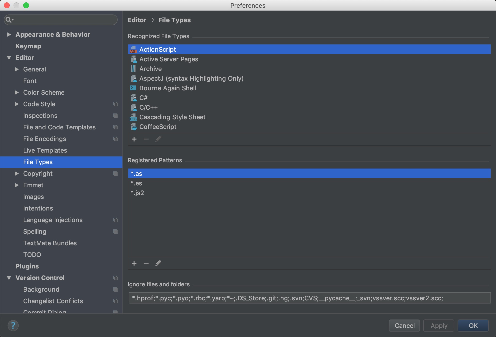
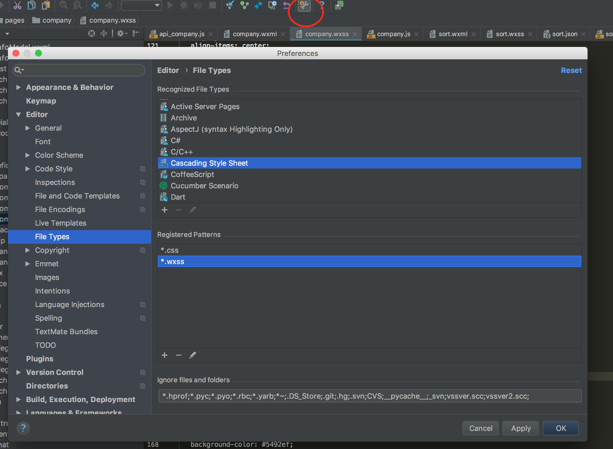
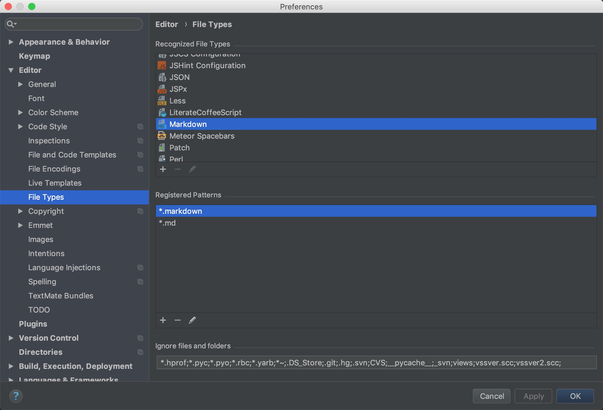

# 总结webstorm的一些配置

## 在配置里加后缀，可以让指定文件夹不显示

* 有时候需要让一些文件夹不显示，比如打包文件dist不显示

## 微信小程序配置后缀

## debug调试

## 设置command shift f的查找范围，右边红色表示忽略文件

## 设置markdown打开方式

webstorm使用之markdown插件

步骤 打开webstorm，File-->Preferences-->输入plugin-->Install JetBrains plugin...-->输入markdown-->点击右边的“Install”,安装完，重启webstorm。

新建test.md，然后编辑，如果没有效果的话。File-->Setting-->输入file type-->找到Markdown-->在下面的Registers Patterns添加上*.md。

