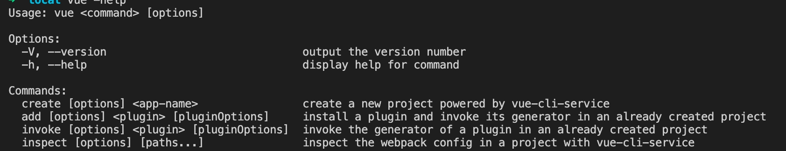

## 脚手架的执行原理如下：
* 在终端输入 `vue create vue-test-app`
* 终端解析出 vue命令
* 终端在环境变量中找到vue命令
* 终端根据vue命令链接到实际文件vue.js
* 终端利用node执行 vue.js
* vue.js 解析 command/options
* vue.js 执行 command
* 执行完毕，退出执行

### 软链接
`ln -s 目标地址 名称`


## 脚手架开发流程
### 开发流程
* 创建npm项目
* 创建脚手架入口文件，最上方添加：
```bash
#!usr/bin/env node
# 提示操作系统通过env，在环境变量中找到node，通过node执行当前入口文件
```
* 配置package.json，添加bin属性
* 编写脚手架代码
* 将脚手架发布到npm
### 使用流程
* 安装脚手架
```bash
npm install -g your-own-cli
```

* 使用脚手架
```bash
your-own-cli
```

## 脚手架开发难点
* 分包： 将复杂的系统拆分成若干个模块
* 命令注册：
```bash
vue create
vue add
vue invoke
```
* 参数解析
```bash
vue command [options] <params>
```
* options全称： --version、--help
* options简写： -V、-h
* 带params的options： --path /Users/sam/desktop/vue-test
* 帮助文档
   - global help
   * Usage
   * Options
   * Commands
帮助信息
   
```bash
   usage: vue <command> [options]

   options: 
   -v --version

   command: 
   create [options] <app-name>
   ```
示例


## 脚手架本地link标准流程
* 链接本地脚手架
```bash
cd your-cli-dir
npm link  # 将当前项目链接到node全局node_modules中作为一个库文件，并解析bin配置创建可执行文件
```

* 链接本地库文件
```bash
cd your-lib-dir
npm link
cd your-cli-dir
npm link your-lib # 将当前项目中的node_modules下指定的库文件链接到node 全局node_modules下的库文件
```
* 取消链接本地库文件
```bash
cd your-lib-dir
npm unlink  # 将当前项目从node全局node_modules中移除
cd your-cli-dir
# link 存在
npm unlink your-lib # 将当前项目中的库文件依赖移除
# link不存在
rm -rf node_modules
npm install -s your-lib
```
