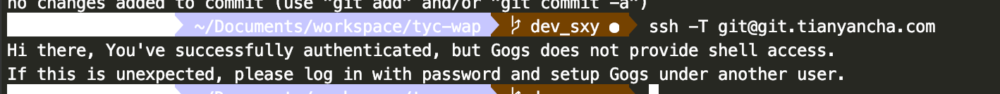

## 管理git生成的多个ssh key

[来自简书](https://www.jianshu.com/p/f7f4142a1556)
### 问题阐述

* 当有多个git账号的时候，比如一个github，用于自己进行一些开发活动，再来一个gitlab，一般是公司内部的git。这两者你的邮箱如果不同的话，就会涉及到一个问题，生成第二个git的key的时候会覆盖第一个的key，导致必然有一个用不了。

### 问题解决

* 我们可以在~/.ssh目录下新建一个config文件配置一下，就可以解决问题

### 具体步骤

* 生成第一个ssh key(这里我用于github，用的gmail邮箱)

        ssh-keygen -t rsa -C "yourmail@gmail.com"

    这里不要一路回传，让你选择在哪里选择存放key的时候写个名字，比如 id_rsa_github，之后的两个可以回车。
完成之后我们可以看到~/.ssh目录下多了两个文件
    ~/.ssh目录下的文件

     

* 生成第二个ssh key（这里我用于gitlab，用的是公司邮箱）

        ssh-keygen -t rsa -C "yourmail@gmail.com"

    还是一样不要一路回车，在第一个对话的时候继续写个名字，比如 id_rsa_gitlab,之后的两个可以回车。

    完成之后我们可以看到如2中图所标记，一样出现两个文件。（一个公钥一个私钥）

* 打开ssh-agent

    这里如果你用的github官方的bash，ssh-agent -s,如果是其他的，比如msysgit,eval $(ssh-agent -s)

* 添加私钥

        ssh-add ~/.ssh/id_rsa_github
        ssh-add ~/.ssh/id_rsa_gitlab

* 创建并修改config文件

    在windows下新建一个txt文本，然后将名字后缀一起改成config即可

    在bash下的话直接touch config 即可。

    添加一下内容

        # gitlab
        Host git.iboxpay.com
            HostName git.iboxpay.com  //这里填你们公司的git网址即可
            PreferredAuthentications publickey
            IdentityFile ~/.ssh/id_rsa_gitlab
            User zhangjun

        # github
        Host github.com
            HostName github.com
            PreferredAuthentications publickey
            IdentityFile ~/.ssh/id_rsa_github
            User ZJsnowman

* 在github和gitlab上添加公钥即可，这里不再多说。
* 测试

    

    分别测试githab和gitlub

    PS:如果到这里你没有成功的话，别急，教你解决问题的终极办法--debug

    比如测试github，ssh -vT git@github.com

    -v 是输出编译信息，然后根据编译信息自己去解决问题吧。就我自己来说一般是config里的host那块写错了。

### 补充一下

如果之前有设置全局用户名和邮箱的话，需要unset一下

    git config --global --unset user.name
    git config --global --unset user.email

然后在不同的仓库下设置局部的用户名和邮箱
比如在公司的repository下git config user.name "yourname" git config user.email "youremail" 在自己的github的仓库在执行刚刚的命令一遍即可。
这样就可以在不同的仓库，已不同的账号登录。

## 设置远程git的方法
> auth 杜若

* 查看自己的用户名和邮箱地址：

        $ git config user.name
        $ git config user.email
* (全局)修改自己的用户名和邮箱地址：

        $ git config --global user.name "xxx"
        $ git config --global user.email "xxx"

* (局部)修改自己的用户名和邮箱地址

        $ git config user.name “gitlab’s Name”
        $ git config user.email "gitlab@xx.com"
        $ git config --list

* 查看配置信息

        $ git config list

## git本地链接远程仓库的方法（ps：写过代码之后再提交到远程仓库）

* 先在本地 $ git init，之后

        $ git remote add origin git@github.com:han1202012/TabHost_Test.git(你的git仓库地址)

## tag问题，[Git 基础 - 打标签](https://git-scm.com/book/zh/v1/Git-%E5%9F%BA%E7%A1%80-%E6%89%93%E6%A0%87%E7%AD%BE)

1. 列显已有的标签

        $ git tag

* 只对1.4.2系列的版本感兴趣

        $ git tag -l 'v1.4.2.*'

2. 新建标签

        $ git tag -a v1.4 (-m 'my version 1.4')
        $ git tag
        v0.1
        v1.4

* 把-a换成-s属于签署标签
* 可以使用 git show 命令查看相应标签的版本信息，并连同显示打标签时的提交对象。

3. 验证标签
* 可以使用 git tag -v [tag-name] （译注：取 verify 的首字母）的方式验证已经签署的标签。此命令会调用 GPG 来验证签名，所以你需要有签署者的公钥，存放在 keyring 中，才能验证

4. 验证标签
* 后期加注标签

        $ git log --pretty=oneline // 展示提交历史
        $ git tag -a v0.1 9fceb02  // 对应提交对象的校验和（或前几位字符）

5. 分享标签（把tag标签提交给远程）

* 默认情况下，git push 并不会把标签传送到远端服务器上，只有通过显式命令才能分享标签到远端仓库。其命令格式如同推送分支，运行 git push origin [tagname] 即可：

        $ git push origin v1.5
        git push --tags   //如果要一次推送所有本地新增的标签上去，可以使用 --tags 选项

6. 删除远程tag

        $ git push origin --delete tag <tagname>
        $ git tag -d 20181127  删除本地tag

##   [Git 工具 - 储藏（Stashing）](https://git-scm.com/book/zh/v1/Git-%E5%B7%A5%E5%85%B7-%E5%82%A8%E8%97%8F%EF%BC%88Stashing%EF%BC%89)

1. 想切换分支，并且不想提交正在进行的工作，所有需要储藏这些变更

        $ git status //(自己变动的目录)
        $ git stash
        $ git status  // 目录清理干净

* 这时，你可以方便地切换到其他分支工作；你的变更都保存在栈上。要查看现有的储藏，你可以使用 git stash list：

        $ git stash list  // 自己储藏的列表
        $ git stash apply // 最新实施的储藏，为默认
        $ git stash apply stash@{2}  // 指明哪个